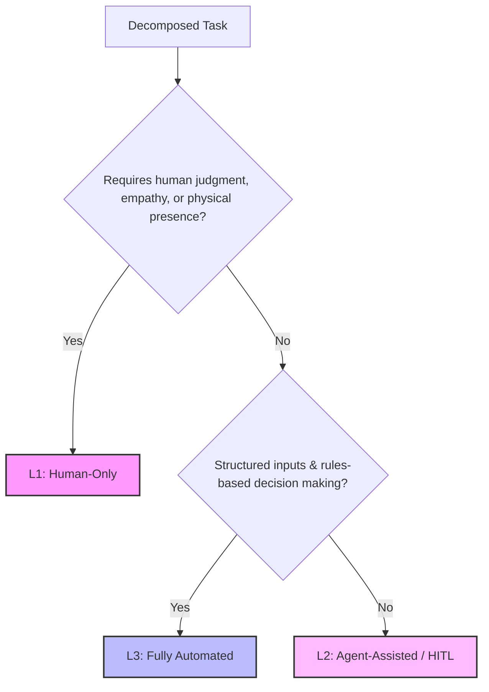

# Phase 1: Opportunity Discovery & Deconstruction Reference

This reference outlines the frameworks and templates to execute Phase 1: Opportunity Discovery & Deconstruction.

---

## 1. Current State Intake & Targeted Probing

To uncover hidden inefficiencies, you MUST NOT rely on a superficial overview of the process. You MUST actively probe the user for granular details. Use these targeted questions to guide your conversation and uncover the real pain points:

### Targeted Interview Questions
*   **Handoff Friction:** *"Where does work change hands between teams or individuals? Are there delays, miscommunications, or file formatting issues during these handoffs?"*
*   **Manual Labor Bottlenecks:** *"Which specific step requires the most manual copy-pasting, double data-entry, or switching between multiple applications?"*
*   **Decision Blockers:** *"Where does the process stall because it is waiting for approval, verification, or complex calculations?"*
*   **Quality & Rework:** *"Where do errors or omissions crop up most frequently? What steps require rework, and how long does that rework take?"*
*   **Information Retrieval:** *"How much time is spent searching for files, reading long emails, or digging up historical data to make a decision?"*

---

## 2. Task Decomposition Template

Once the process is defined, decompose it into its constituent tasks using the template below. Map every step from start to finish.

| Task ID | Task Name | Step Description | Actor (Who does it?) | Systems/Tools | Key Inputs | Key Outputs | Frequency (e.g., daily, monthly) |
| :--- | :--- | :--- | :--- | :--- | :--- | :--- | :--- |
| **T1** | E.g., Intake Triage | Review incoming support requests and categorize them. | Support Ops | Outlook, Zendesk | Customer Email | Categorized Ticket | ~100 / day |
| **T2** | E.g., Data Retrieval | Pull customer contract details from Salesforce. | Support Rep | Salesforce CRM | Customer ID | Contract details | ~100 / day |
| **T3** | E.g., Analysis & Draft | Compare request against SLA and draft a response. | Support Rep | MS Word, Gmail | Contract & Ticket | Response Draft | ~100 / day |

---

## 3. The Autonomy Spectrum Framework

Classify each decomposed task according to its potential for automation and augmentation:



### Autonomy Levels

1.  **L1: Human-Only (Manual / Strategic)**
    *   *Characteristics:* Highly subjective, requires deep emotional intelligence, relationship management, or strategic business-level decisions.
    *   *Examples:* Client escalation negotiation, high-stakes budget approvals, sensitive HR issues.
    *   *Agent Role:* None (or simple data provision).

2.  **L2: Agent-Assisted (Human-in-the-Loop / HITL)**
    *   *Characteristics:* Tasks requiring synthesis, calculations, data aggregation, draft generation, or complex but bounded decision making. Needs human verification before committing actions.
    *   *Examples:* Underwriting analysis, drafting responses based on contract terms, generating executive reports.
    *   *Agent Role:* The agent does the heavy lifting (retrieval, synthesis, drafting), and the human serves as a quality gate.

3.  **L3: Fully Automated (Autonomous)**
    *   *Characteristics:* Highly structured, deterministic, repetitive tasks with low risk and clear failure modes.
    *   *Examples:* Data sync between systems, simple report formatting, automated invoice matching.
    *   *Agent Role:* Executes end-to-end, logs activity, and triggers alerts on exceptions.

---

## 4. Baseline Quantification (Time, Cost, Error Rate)

To establish a mathematically defensible baseline, quantify the "As-Is" process. If the user does not have precise numbers, **propose the following industry-standard research-based starting figures** and allow the user to adjust them.

### Research-Based Labor Rate Baselines (Fully Burdened)
*   **Administrative / Operations Support:** `$35.00 / hour` (incorporates base salary, taxes, benefits, and overhead).
*   **Specialized Analyst / Junior Manager:** `$75.00 / hour`.
*   **Senior Manager / Director:** `$150.00 / hour`.

### Core Baseline Calculations
Use these formulas to calculate the annual impact of each task:

$$\text{Annualized Time Spend (Hours)} = \text{Task Cycle Time (Hours)} \times \text{Annual Volume (Transactions)}$$

$$\text{Annualized Labor Cost} = \text{Annualized Time Spend (Hours)} \times \text{Fully Burdened Labor Rate} (\$/\text{Hour})$$

$$\text{Annual Rework Cost (Errors)} = \text{Annual Volume} \times \text{Error Rate (\%)} \times \text{Time to Fix (Hours)} \times \text{Labor Rate} (\$/\text{Hour})$$

### Baseline Reporting Template

For every high-friction process, compile the baseline scorecard:

```
=============================================
PROCESS BASELINE SCORECARD (As-Is)
=============================================
Process Name: [Process Title]
Annual Volume: [X] transactions / year

• Total Time Spent:  [Hours] hours / year
• Labor Cost Baseline: $[Cost] / year
• Rework (Error) Cost: $[Cost] / year
─────────────────────────────────────────────
TOTAL PROCESS BASELINE: $[Total Cost] / year
=============================================
```

---

## 5. "As-Is" Process Analysis & Findings Report Template

This is the formal layout for **Output 1**. Use this template to compile the final As-Is report:

```markdown
# "As-Is" Process Analysis & Findings Report: [Process Title]

## 1. Executive Summary
- [High-level summary of the process, the primary business outcomes it delivers, and the core friction areas identified during intake.]

## 2. Current-State Workflow Deconstruction
- [Insert the completed Task Decomposition Table mapping all baseline steps, systems, actors, and cycle times.]
- [Insert the Autonomy Classification Analysis, detailing what tasks fall under L1, L2, and L3.]

## 3. Key Operational Friction Points & Bottlenecks
- **Handoff Inefficiencies:** [Where delays, formatting gaps, or communication breakdowns occur during handoffs between actors/teams.]
- **Manual Labor Blocks:** [Steps dominated by high-frequency copy-pasting, manual typing, or data replication.]
- **Decision & Delay Points:** [Where the process stalls waiting for reviews, approvals, or database provisioning.]
- **Error & Rework Analysis:** [Identify common error points, why they occur, and how long the correction loop takes.]

## 4. Process Baseline Scorecard
- [Insert the formatted PROCESS BASELINE SCORECARD with annualized time, labor cost, and rework metrics.]
- [List the specific cost assumptions used: annual volume, labor rates, error rates, and rework times.]
```

