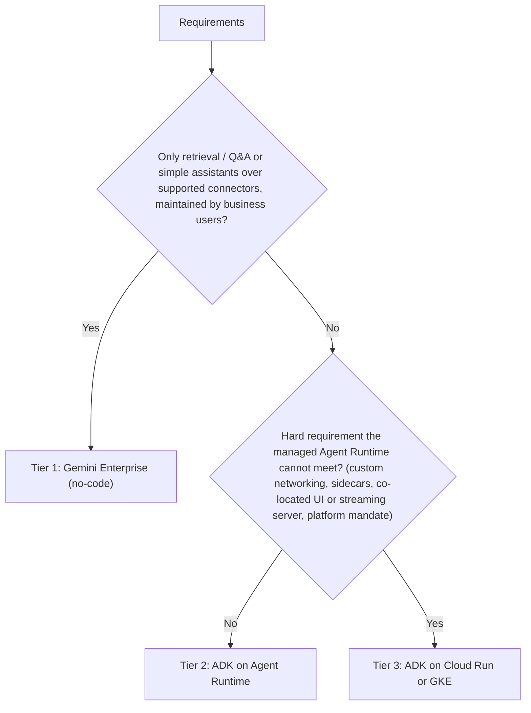

# GCP Agent Architecture Advisor

Turns requirements into one defensible tier choice plus the evidence behind it. The most
common failure is recommending a product on stale knowledge, so **launch stages are always
looked up, never recalled.**

## 1. The three tiers

| Tier | What it is | Choose when | You operate |
|---|---|---|---|
| **1 - No-code** | Agents built and used inside **Gemini Enterprise** (and its prebuilt/search agents and connectors) | Knowledge Q&A, enterprise search, simple assistants over supported connectors; business users maintain it | Configuration only |
| **2 - Code-first, managed runtime** | Agent written with **ADK**, deployed to **Agent Runtime** (the managed agent hosting service, formerly "Vertex AI Agent Engine") | Custom tools, APIs, multi-step or multi-agent logic, managed sessions/memory, optional publishing to Gemini Enterprise | Agent code; the platform runs it |
| **3 - Code-first, self-hosted** | ADK agent (or another framework) on **Cloud Run** or **GKE** | Custom networking or serving needs, sidecars, unusual scaling, streaming/UI in the same service, strict platform standardization | Code, container, scaling, networking |

Tier 2 and Tier 3 use the same ADK code. Moving between them is mostly a deployment change,
so pick the lowest operational burden that meets the hard constraints.

## 2. Decision procedure

### Step 1: Extract constraints from the inputs

Read `docs/PRD.md` and the intake notes (from [workshop-intake](../../workshop-intake/SKILL.md)).
Record each constraint with the source line it came from:

- **Logic:** retrieval/Q&A only vs. tool calls vs. multi-step or multi-agent orchestration
- **Integrations:** supported connectors vs. custom REST/gRPC vs. on-prem systems
- **Data and compliance:** residency, VPC Service Controls, CMEK, PHI/PCI, audit needs
- **Interaction:** chat in Gemini Enterprise vs. an embedded or custom UI vs. voice or streaming
- **Maintainers:** business analysts vs. an engineering team, and who is on call
- **Scale and latency:** peak QPS, p95 latency target, cost ceiling

### Step 2: Apply the decision tree



A "cannot meet" claim in the second branch must cite the doc or test that shows the gap. A
preference is not a hard requirement.

### Step 3: Verify launch stages (mandatory)

For every component in the recommended stack (runtime, model, memory/sessions, gateway,
connectors, eval tooling):

1. Look up its current launch stage (GA, Preview, Experimental / Private Preview) on the
   official Google Cloud documentation or release-notes page.
2. Record the stage, the URL and the date checked.
3. Preview components may be used in pilots. Use them in production only with the client's
   explicit acceptance of Preview terms, recorded in the recommendation.
4. If you cannot access the docs, mark the stage **UNVERIFIED** and list it as an open risk.
   Do not fill it in from memory.

### Step 4: Write `docs/ARCHITECTURE_RECOMMENDATION.md`

```markdown
# Agent Architecture Recommendation
Date: <YYYY-MM-DD>   Author: <name>   Inputs: docs/PRD.md, <intake notes path>

## 1. Recommendation
- Tier: <1 | 2 | 3>
- Stack: <e.g. ADK (Python) on Agent Runtime; <model>; Cloud SQL for app data>
- Why (2-3 sentences): <the constraints that decided it>

## 2. Constraints -> decision
| Constraint | Source | Effect on tier |
|---|---|---|

## 3. Alternatives considered
| Criterion | Tier 1 | Tier 2 | Tier 3 |
|---|---|---|---|
| Meets hard constraints | | | |
| Team can maintain it | | | |
| Time to first working agent | | | |
| Ops burden | | | |
| Cost drivers | | | |

## 4. Component launch stages (verified)
| Component | Stage | Source URL | Checked on | Production OK? |
|---|---|---|---|---|

## 5. Topology
<mermaid: user -> channel -> agent -> tools -> data/services, with trust boundaries>

## 6. Security and compliance
IAM / service accounts, network perimeter, data residency, secrets, logging of prompts and responses.

## 7. Risks and open questions
| Risk | Likelihood | Impact | Mitigation | Owner |
|---|---|---|---|---|
```

## 3. Hand-offs

- **Tier 2 or 3:** the implementation plan goes to the TDL Phase 3 build; the optional
  `google-agents-cli-scaffold` / `google-agents-cli-deploy` skills cover scaffolding and
  deployment.
- **Security:** feed section 6 into the Phase 2 threat model.
- **Cost:** feed the cost drivers into [ai-value-sizing](../../ai-value-sizing/SKILL.md) for TCO.

## 4. Anti-patterns

- Picking Tier 3 "for flexibility" without a documented hard requirement.
- Picking Tier 1 when the PRD needs write actions against custom systems.
- Copying a maturity table from an older document instead of re-verifying.
- Recommending without citing which PRD or intake lines drove the decision.
