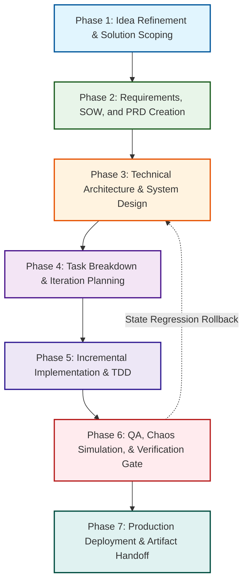

# End-to-End Customer Project Delivery Workflow (Future-Proofed & Main Branch Grounded)

This workflow orchestrates the **official main branch skills** from the primary repositories into a 7-phase customer delivery lifecycle, from initial scoping and Statement of Work (SOW) to production sign-off and auditing.

---

## 🔗 Official Repository Sources (Main Branch)
* **[Delta Meta-Skills]** = [enriquekalven/delta-skills (main)](https://github.com/enriquekalven/delta-skills/tree/main)
* **[PM]** = [phuryn/pm-skills (main)](https://github.com/phuryn/pm-skills/tree/main)
* **[MP]** = [mattpocock/skills (main)](https://github.com/mattpocock/skills/tree/main)
* **[AO]** = [addyosmani/agent-skills (main)](https://github.com/addyosmani/agent-skills/tree/main)
* **[G]** = [google/agents-cli (main)](https://github.com/google/agents-cli/tree/main)

---

## 🛡️ Future-Proofed Orchestration Engine
To run this 7-Phase Workflow iteratively using state-gated tracking (`STATE.md`) with dynamic capability slots and rollback loops, trigger:
```bash
# Trigger the Future-Proofed Master Orchestrator
"Let's run e2e-delivery-workflow for this project."
```
* **Orchestrator Source**: [`e2e-delivery-workflow`](https://github.com/enriquekalven/delta-skills/tree/main/skills/e2e-delivery-workflow)

---

## 🗺️ The E2E Project Lifecycle (With Regression Loops)



---

## 📋 Phase-by-Phase Dynamic Capability Resolution

### Phase 1: Idea Refinement & Solution Scoping
* **Capability Slots**: `#CAPABILITY: Idea-Refinement`, `#CAPABILITY: Opportunity-Mapping`, `#CAPABILITY: Pretotyping`
* **Resolved Skills**:
  * **[`idea-refine`](https://github.com/addyosmani/agent-skills/tree/main/skills/idea-refine)** [AO] — Divergent/convergent thinking.
  * **[`opportunity-solution-tree`](https://github.com/phuryn/pm-skills/tree/main/pm-product-discovery/skills/opportunity-solution-tree)** [PM] — Outcome-to-feature mapping.
  * **[`brainstorm-experiments-new`](https://github.com/phuryn/pm-skills/tree/main/pm-product-discovery/skills/brainstorm-experiments-new)** [PM] — Alberto Savoia pretotyping.

### Phase 2: Requirements, SOW, and PRD Creation
* **Capability Slots**: `#CAPABILITY: PRD-Creation`, `#CAPABILITY: Red-Teaming`, `#CAPABILITY: Metrics-Design`
* **Resolved Skills**:
  * **[`create-prd`](https://github.com/phuryn/pm-skills/tree/main/pm-execution/skills/create-prd)** [PM] — 8-section PRD with Goals and Non-Goals.
  * **[`spec-driven-development`](https://github.com/addyosmani/agent-skills/tree/main/skills/spec-driven-development)** [AO] — Structural spec bounds.
  * **[`strategy-red-team`](https://github.com/phuryn/pm-skills/tree/main/pm-execution/skills/strategy-red-team)** [PM] — Attack load-bearing assumptions.

### Phase 3: Technical Architecture & System Design
* **Capability Slots**: `#CAPABILITY: Architecture-Grilling`, `#CAPABILITY: API-Design`, `#CAPABILITY: InfoSec-Threat-Modeling`
* **Resolved Skills**:
  * **[`grill-with-docs`](https://github.com/mattpocock/skills/tree/main/skills/engineering/grill-with-docs)** [MP] — Architecture grilling to ADRs & `CONTEXT.md`.
  * **[`api-and-interface-design`](https://github.com/addyosmani/agent-skills/tree/main/skills/api-and-interface-design)** [AO] — Deep module seams & API contracts.
  * **[`google-agents-cli-adk-code`](https://github.com/google/agents-cli/tree/main/skills/google-agents-cli-adk-code)** [G] — ADK Python API architecture.

### Phase 4: Task Breakdown & Iteration Planning
* **Capability Slots**: `#CAPABILITY: Task-Breakdown`, `#CAPABILITY: Ticket-Splitting`, `#CAPABILITY: Pre-Mortem`
* **Resolved Skills**:
  * **[`planning-and-task-breakdown`](https://github.com/addyosmani/agent-skills/tree/main/skills/planning-and-task-breakdown)** [AO] — Task decomposition.
  * **[`to-tickets`](https://github.com/mattpocock/skills/tree/main/skills/engineering/to-tickets)** [MP] — Dependency graph & blocking edges.
  * **[`pre-mortem`](https://github.com/phuryn/pm-skills/tree/main/pm-execution/skills/pre-mortem)** [PM] — Risk classification (Tigers, Paper Tigers, Elephants).

### Phase 5: Incremental Implementation & TDD
* **Capability Slots**: `#CAPABILITY: Vertical-Slicing`, `#CAPABILITY: TDD`, `#CAPABILITY: Source-Grounding`
* **Resolved Skills**:
  * **[`incremental-implementation`](https://github.com/addyosmani/agent-skills/tree/main/skills/incremental-implementation)** [AO] — Thin vertical slices.
  * **[`test-driven-development`](https://github.com/addyosmani/agent-skills/tree/main/skills/test-driven-development)** [AO/MP] — Red-Green-Refactor logic.
  * **[`source-driven-development`](https://github.com/addyosmani/agent-skills/tree/main/skills/source-driven-development)** [AO] — Ground API calls in official docs.

### Phase 6: QA, Chaos Simulation, & Verification Gate
* **Capability Slots**: `#CAPABILITY: Intent-Audit`, `#CAPABILITY: Security-Hardening`, `#CAPABILITY: Code-Review`, `#CAPABILITY: Agent-Evaluation`
* **Resolved Skills**:
  * **[`intended-vs-implemented`](https://github.com/phuryn/pm-skills/tree/main/pm-ai-shipping/skills/intended-vs-implemented)** [PM] — Audit documented intent vs actual code.
  * **[`security-and-hardening`](https://github.com/addyosmani/agent-skills/tree/main/skills/security-and-hardening)** [AO] — OWASP Top 10 boundary controls.
  * **[`code-review-and-quality`](https://github.com/addyosmani/agent-skills/tree/main/skills/code-review-and-quality)** [AO/MP] — 5-axis code review.
  * **[`google-agents-cli-eval`](https://github.com/google/agents-cli/tree/main/skills/google-agents-cli-eval)** [G] — Eval-on-Commit regression suites.
* **🔄 Regression Trigger**: If Intent Audit exposes breaking architectural drift, trigger `ACTION: ROLLBACK_TO_PHASE_3` in `STATE.md`.

### Phase 7: Production Deployment & Artifact Handoff
* **Capability Slots**: `#CAPABILITY: Release-Launch`, `#CAPABILITY: Handoff-Artifacts`, `#CAPABILITY: Cloud-Deploy`
* **Resolved Skills**:
  * **[`shipping-and-launch`](https://github.com/addyosmani/agent-skills/tree/main/skills/shipping-and-launch)** [AO] — Pre-launch & rollback manifests.
  * **[`shipping-artifacts`](https://github.com/phuryn/pm-skills/tree/main/pm-ai-shipping/skills/shipping-artifacts)** [PM] — Comprehensive handoff packet (`architecture.md`, `flows.md`, `variables.md`).
  * **[`google-agents-cli-deploy`](https://github.com/google/agents-cli/tree/main/skills/google-agents-cli-deploy)** & **[`publish`](https://github.com/google/agents-cli/tree/main/skills/google-agents-cli-publish)** [G] — Cloud Run/GKE & Gemini Enterprise registry.
