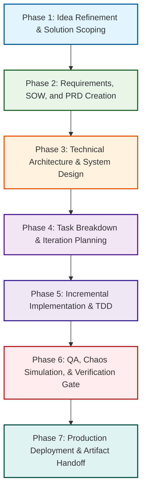

# End-to-End Customer Project Delivery Workflow (Strict Main Branch Grounded)

This workflow orchestrates the **official main branch skills** from the primary repositories into a 7-phase customer delivery lifecycle, from initial scoping and Statement of Work (SOW) to production sign-off and auditing.

---

## 🔗 Official Repository Sources (Main Branch)
* **[PM]** = [phuryn/pm-skills (main)](https://github.com/phuryn/pm-skills/tree/main)
* **[MP]** = [mattpocock/skills (main)](https://github.com/mattpocock/skills/tree/main)
* **[AO]** = [addyosmani/agent-skills (main)](https://github.com/addyosmani/agent-skills/tree/main)
* **[G]** = [google/agents-cli (main)](https://github.com/google/agents-cli/tree/main)

---

## 🗺️ The E2E Project Lifecycle

---

## 📋 Phase-by-Phase Skill Matrix

### Phase 1: Idea Refinement & Solution Scoping
*Goal: Turn the customer's initial request into a validated SOW scope.*
* **[`idea-refine`](https://github.com/addyosmani/agent-skills/tree/main/skills/idea-refine)** [AO] — Divergent/convergent thinking to refine vague ideas.
* **[`opportunity-solution-tree`](https://github.com/phuryn/pm-skills/tree/main/pm-product-discovery/skills/opportunity-solution-tree)** [PM] — Map customer outcomes to discrete opportunities.
* **[`brainstorm-ideas-new`](https://github.com/phuryn/pm-skills/tree/main/pm-product-discovery/skills/brainstorm-ideas-new)** / **[`existing`](https://github.com/phuryn/pm-skills/tree/main/pm-product-discovery/skills/brainstorm-ideas-existing)** [PM] — Multi-perspective ideation (PM, UX, Engineer).
* **[`identify-assumptions-new`](https://github.com/phuryn/pm-skills/tree/main/pm-product-discovery/skills/identify-assumptions-new)** [PM] — Risk assessment across value, viability, and feasibility.
* **[`brainstorm-experiments-new`](https://github.com/phuryn/pm-skills/tree/main/pm-product-discovery/skills/brainstorm-experiments-new)** [PM] — Alberto Savoia pretotyping and XYZ hypothesis testing.

### Phase 2: Requirements, SOW, and PRD Creation
*Goal: Lock down SOW boundaries, PRD scope, and success metrics.*
* **[`spec-driven-development`](https://github.com/addyosmani/agent-skills/tree/main/skills/spec-driven-development)** [AO] — Comprehensive PRD covering structure, code style, testing, and boundaries.
* **[`create-prd`](https://github.com/phuryn/pm-skills/tree/main/pm-execution/skills/create-prd)** [PM] — Structured 8-section PRD with explicit Goals and Non-Goals.
* **[`draft-nda`](https://github.com/phuryn/pm-skills/tree/main/pm-toolkit/skills/draft-nda)** & **[`privacy-policy`](https://github.com/phuryn/pm-skills/tree/main/pm-toolkit/skills/privacy-policy)** [PM] — Contractual utility templates for SOW governance.
* **[`strategy-red-team`](https://github.com/phuryn/pm-skills/tree/main/pm-execution/skills/strategy-red-team)** [PM] — Red-team the PRD to attack load-bearing assumptions before reality does.
* **[`metrics-dashboard`](https://github.com/phuryn/pm-skills/tree/main/pm-product-discovery/skills/metrics-dashboard)** & **[`north-star-metric`](https://github.com/phuryn/pm-skills/tree/main/pm-marketing-growth/skills/north-star-metric)** [PM] — Define KPIs, constellation metrics, and alert thresholds.
* **[`value-proposition`](https://github.com/phuryn/pm-skills/tree/main/pm-product-strategy/skills/value-proposition)** [PM] — 6-part JTBD value prop alignment.

### Phase 3: Technical Architecture & System Design
*Goal: Design deep software modules, API seams, and data trust boundaries.*
* **[`grill-with-docs`](https://github.com/mattpocock/skills/tree/main/skills/engineering/grill-with-docs)** [MP] — Codebase-aware grilling session updating `CONTEXT.md` and ADRs.
* **[`domain-modeling`](https://github.com/mattpocock/skills/tree/main/skills/engineering/domain-modeling)** [MP] / [AO] — Sharpen domain language and ubiquitous terms.
* **[`codebase-design`](https://github.com/mattpocock/skills/tree/main/skills/engineering/codebase-design)** [MP] — Design deep modules behind simple interfaces at clean seams.
* **[`api-and-interface-design`](https://github.com/addyosmani/agent-skills/tree/main/skills/api-and-interface-design)** [AO] — Contract-first design, Hyrum's Law, error semantics.
* **[`semantic-paradigm-auditor`](https://github.com/addyosmani/agent-skills/tree/main/skills/semantic-paradigm-auditor)** [AO] — Detect architectural mismatches and pattern physics.
* **[`google-agents-cli-adk-code`](https://github.com/google/agents-cli/tree/main/skills/google-agents-cli-adk-code)** [G] — ADK Python API (agents, tools, callbacks, state management).

### Phase 4: Task Breakdown & Iteration Planning
*Goal: Decompose specs into small, verifiable implementation units.*
* **[`planning-and-task-breakdown`](https://github.com/addyosmani/agent-skills/tree/main/skills/planning-and-task-breakdown)** [AO] — Decompose specs into small tasks with acceptance criteria.
* **[`to-tickets`](https://github.com/mattpocock/skills/tree/main/skills/engineering/to-tickets)** [MP] — Split plans into tracer-bullet tickets declaring blocking edges.
* **[`job-stories`](https://github.com/phuryn/pm-skills/tree/main/pm-execution/skills/job-stories)** & **[`user-stories`](https://github.com/phuryn/pm-skills/tree/main/pm-execution/skills/user-stories)** [PM] — User stories following INVEST and 3 C's criteria.
* **[`prioritization-frameworks`](https://github.com/phuryn/pm-skills/tree/main/pm-execution/skills/prioritization-frameworks)** [PM] — RICE, ICE, Kano, MoSCoW prioritization formulas.
* **[`sprint-plan`](https://github.com/phuryn/pm-skills/tree/main/pm-execution/skills/sprint-plan)** [PM] — Capacity estimation, story selection, and dependency mapping.
* **[`pre-mortem`](https://github.com/phuryn/pm-skills/tree/main/pm-execution/skills/pre-mortem)** [PM] — Risk analysis classifying launch threats into Tigers, Paper Tigers, and Elephants.

### Phase 5: Incremental Implementation & TDD
*Goal: Write clean code safely, one vertical slice at a time.*
* **[`incremental-implementation`](https://github.com/addyosmani/agent-skills/tree/main/skills/incremental-implementation)** [AO] — Thin vertical slices, test, verify, commit.
* **[`test-driven-development`](https://github.com/addyosmani/agent-skills/tree/main/skills/test-driven-development)** [AO] / [MP] — Red-Green-Refactor, DAMP over DRY, test size rules.
* **[`implement`](https://github.com/mattpocock/skills/tree/main/skills/engineering/implement)** [MP] — Build specs by driving TDD internally and closing with code review.
* **[`source-driven-development`](https://github.com/addyosmani/agent-skills/tree/main/skills/source-driven-development)** [AO] — Ground API decisions in official documentation.
* **[`context-engineering`](https://github.com/addyosmani/agent-skills/tree/main/skills/context-engineering)** [AO] — Optimize token density and agent context setup.
* **[`frontend-ui-engineering`](https://github.com/addyosmani/agent-skills/tree/main/skills/frontend-ui-engineering)** [AO] — Design systems, state management, WCAG 2.1 AA accessibility.
* **[`ast-resilient-remediation`](https://github.com/addyosmani/agent-skills/tree/main/skills/ast-resilient-remediation)** [AO] — Structural code remediation via AST parsing.
* **[`resolving-merge-conflicts`](https://github.com/mattpocock/skills/tree/main/skills/engineering/resolving-merge-conflicts)** [MP] — Intent-based hunk-by-hunk conflict resolution.

### Phase 6: QA, Chaos Simulation, & Verification Gate
*Goal: Verify structural hardness, performance, and security prior to release.*
* **[`intended-vs-implemented`](https://github.com/phuryn/pm-skills/tree/main/pm-ai-shipping/skills/intended-vs-implemented)** [PM] — Audit the gap between documented intent and actual code.
* **[`chaos-simulation-and-mocking`](https://github.com/addyosmani/agent-skills/tree/main/skills/chaos-simulation-and-mocking)** [AO] — Tool mocking and chaos proxy simulation.
* **[`browser-testing-with-devtools`](https://github.com/addyosmani/agent-skills/tree/main/skills/browser-testing-with-devtools)** [AO] — Chrome DevTools runtime profiling and DOM inspection.
* **[`security-and-hardening`](https://github.com/addyosmani/agent-skills/tree/main/skills/security-and-hardening)** [AO] — OWASP Top 10, auth patterns, three-tier boundary system.
* **[`performance-optimization`](https://github.com/addyosmani/agent-skills/tree/main/skills/performance-optimization)** [AO] — Core Web Vitals targets, profiling, bundle analysis.
* **[`inter-agent-protocol-verification`](https://github.com/addyosmani/agent-skills/tree/main/skills/inter-agent-protocol-verification)** [AO] — Multi-agent communication graph auditing.
* **[`code-review-and-quality`](https://github.com/addyosmani/agent-skills/tree/main/skills/code-review-and-quality)** [AO] / [MP] — Five-axis and two-axis diff reviews.
* **[`code-simplification`](https://github.com/addyosmani/agent-skills/tree/main/skills/code-simplification)** [AO] — Rule of 500 complexity reduction.
* **[`google-agents-cli-eval`](https://github.com/google/agents-cli/tree/main/skills/google-agents-cli-eval)** [G] — Evaluation methodology, LLM-as-judge rubrics.

### Phase 7: Production Deployment & Artifact Handoff
*Goal: Deploy safely, automate quality pipelines, and hand off durable documentation.*
* **[`shipping-artifacts`](https://github.com/phuryn/pm-skills/tree/main/pm-ai-shipping/skills/shipping-artifacts)** [PM] — Durable docs packet: `architecture.md`, `flows.md`, `permissions.md`, `variables.md`, `tests.md`.
* **[`shipping-and-launch`](https://github.com/addyosmani/agent-skills/tree/main/skills/shipping-and-launch)** [AO] — Pre-launch checklists, staged rollouts, rollback procedures.
* **[`ci-cd-and-automation`](https://github.com/addyosmani/agent-skills/tree/main/skills/ci-cd-and-automation)** [AO] — Quality gate pipelines and shift-left automation.
* **[`git-workflow-and-versioning`](https://github.com/addyosmani/agent-skills/tree/main/skills/git-workflow-and-versioning)** [AO] — Trunk-based development and atomic versioning.
* **[`release-notes`](https://github.com/phuryn/pm-skills/tree/main/pm-execution/skills/release-notes)** [PM] — User-facing release notes from tickets/changelogs.
* **[`google-agents-cli-deploy`](https://github.com/google/agents-cli/tree/main/skills/google-agents-cli-deploy)** & **[`publish`](https://github.com/google/agents-cli/tree/main/skills/google-agents-cli-publish)** [G] — Google Cloud Run / GKE deployment and Gemini Enterprise registration.
* **[`documentation-and-adrs`](https://github.com/addyosmani/agent-skills/tree/main/skills/documentation-and-adrs)** [AO] — Record architectural decisions for customer handoff.
* **[`retro`](https://github.com/phuryn/pm-skills/tree/main/pm-execution/skills/retro)** [PM] — Facilitate structured sprint retrospectives.
