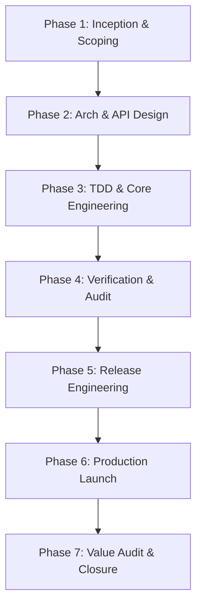

# End-to-End Delivery Workflow & Phase-Gated Execution Guide

> **Master Software Delivery Lifecycle (SDLC) Specification**

This guide specifies the 7-phase software delivery workflow, dynamic capability resolution engine, and state-machine governance model for enterprise AI engineering projects.

---

## 1. 7-Phase Delivery Pipeline

```mermaid
graph TD
    P1["Phase 1: Inception & Scoping"] --> P2["Phase 2: Arch & API Design"]
    P2 --> P3["Phase 3: TDD & Core Engineering"]
    P3 --> P4["Phase 4: Verification & Audit"]
    P4 --> P5["Phase 5: Release Engineering"]
    P5 --> P6["Phase 6: Production Launch"]
    P6 --> P7["Phase 7: Value Audit & Closure"]
```

---

## 2. Dynamic Capability Resolution Matrix

| Phase | Capability Slot | Primary Tool (Tier 1) | Secondary Tool (Tier 2) | Deliverable Artifact |
|---|---|---|---|---|
| **Phase 1** | `#CAPABILITY: Scope-Mapping` | `opportunity-solution-tree` | `user-stories` | Scope Tree |
| **Phase 1** | `#CAPABILITY: PRD-Creation` | `create-prd` | `spec-driven-development` | `docs/PRD.md` |
| **Phase 2** | `#CAPABILITY: Arch-Design` | `gcp-agent-architecture-advisor` | `documentation-and-adrs` | `docs/ARCHITECTURE.md` |
| **Phase 2** | `#CAPABILITY: API-Design` | `api-and-interface-design` | `domain-modeling` | API Contracts |
| **Phase 2** | `#CAPABILITY: Threat-Modeling` | `threat-model-analyst` | `security-and-hardening` | `docs/THREAT_MATRIX.md` |
| **Phase 3** | `#CAPABILITY: TDD-Build` | `test-driven-development` | `superpowers` | Unit Test Suite |
| **Phase 3** | `#CAPABILITY: Code-Simplification` | `ponytail` | `code-simplification` | Clean Interfaces |
| **Phase 4** | `#CAPABILITY: Intent-Audit` | `intended-vs-implemented` | `sql-queries` | Intent Gap Audit |
| **Phase 4** | `#CAPABILITY: Code-Review` | `code-review-and-quality` | `pso-code-quality-reviewer` | Review Sign-off |
| **Phase 5** | `#CAPABILITY: Agent-Evaluation` | `google-agents-cli-eval` | `eval-quality-gate` | Eval Suite |
| **Phase 6** | `#CAPABILITY: Release-Deployment` | `shipping-and-launch` | `google-agents-cli-deploy` | Cloud Run / GKE |
| **Phase 7** | `#CAPABILITY: Value-Audit` | `ai-value-sizing` | `cohort-analysis` | ROI Dashboard |

---

## 3. Governance State Machine vs Anti-Patterns

### State Tracking (`STATE.md`)
Project state is tracked strictly via `STATE.md` at the workspace root. Transitions require explicit human gate verification.

### Anti-Pattern Comparison

| Anti-Pattern | Bad Execution | `delta-skills` State Machine Guard |
|---|---|---|
| **Un-Gated Agent Drift** | Single-prompt "build everything" run | Stops execution at phase gates for human sign-off |
| **Silent Failure Cascade** | Hacking broken code on bad architecture | Triggers `ACTION: ROLLBACK_TO_PHASE_2` in `STATE.md` |
| **Documentation Drift** | Code diverges from PRD/ADRs | Mandates `#CAPABILITY: Intent-Audit` before release |
