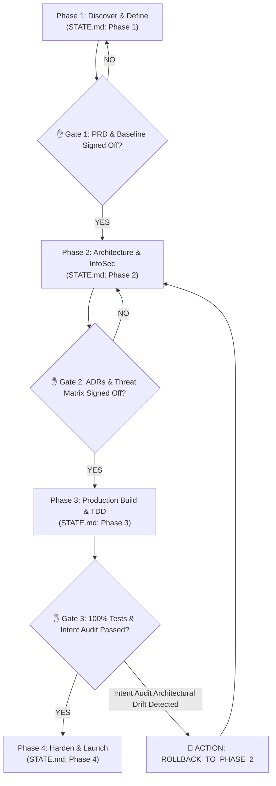

# Masterclass: End-to-End Customer Project Delivery via Meta-Skill Orchestrators

This masterclass maps the **7-Phase Delivery Workflow** to a real-world customer project: building a **Multimodal AI Real Estate Investment Concierge Agent**.

Instead of manually running 90+ individual skills, this masterclass demonstrates how to drive the entire project using the published **Meta-Skill Orchestrators**:
* **[`e2e-delivery-workflow`](https://github.com/enriquekalven/delta-skills/tree/main/skills/e2e-delivery-workflow)** (Master Methodology Meta-Skill)
* **[`tdl-field-guide`](https://github.com/enriquekalven/delta-skills/tree/main/skills/tdl-field-guide)** (12-Week Delta TDL Field Meta-Skill)

---

## 🎯 Sample Project Use Case: Multimodal Real Estate Concierge Agent
* **Customer**: A mid-sized Real Estate investment firm.
* **Objective**: Replace manual deal underwriting with an autonomous ADK Agent running on Google Cloud that reads data from PDFs and API endpoints, calculates ROI, and responds via text or voice.

---

## 🚀 How to Launch via Meta-Skill

Simply initiate your agent conversation with the single Meta-Skill prompt:

```bash
"Let's trigger e2e-delivery-workflow to build the Multimodal Real Estate Concierge Agent."
# OR for Google Cloud Delta Squad Engagements:
"Let's trigger tdl-field-guide to lead this 12-week Real Estate Delta engagement."
```

---

## 🧭 Iterative Phase-by-Phase Meta-Skill Execution

The Meta-Skill reads `STATE.md` in your project root, executes the current phase's **Capability Slots**, and stops for explicit human gate sign-off before advancing.



---

## 📋 Phase-by-Phase Walkthrough

### Phase 1: Idea Refinement & Solution Scoping
* **State Check**: `STATE.md` set to `Phase 1: Discover & Define`.
* **Meta-Skill Action**: Orchestrates `#CAPABILITY: Idea-Refinement`, `#CAPABILITY: Opportunity-Mapping`, and `#CAPABILITY: PRD-Creation`.
* **Underlying Tools Resolved**:
  * [`idea-refine`](https://github.com/addyosmani/agent-skills/tree/main/skills/idea-refine) — Refines text/voice ingestion concepts.
  * [`opportunity-solution-tree`](https://github.com/phuryn/pm-skills/tree/main/pm-product-discovery/skills/opportunity-solution-tree) — Connects 80% ROI speed target to features.
  * [`create-prd`](https://github.com/phuryn/pm-skills/tree/main/pm-execution/skills/create-prd) — Generates PRD with explicit Goals and Non-Goals.
* **Synthetic Baseline**: Audits 50 historical real estate deal files to generate `baseline_kpis.json`.
* **✋ Phase 1 Gate**: Meta-Skill presents `PRD.md` and `baseline_kpis.json` and **stops**. You reply *"Approved"* to advance `STATE.md` to Phase 2.

### Phase 2: Technical Architecture & System Design
* **State Check**: `STATE.md` updated to `Phase 2: Prototype & Validate`.
* **Meta-Skill Action**: Orchestrates `#CAPABILITY: Architecture-Grilling`, `#CAPABILITY: API-Design`, and `#CAPABILITY: InfoSec-Threat-Modeling`.
* **Underlying Tools Resolved**:
  * [`grill-with-docs`](https://github.com/mattpocock/skills/tree/main/skills/engineering/grill-with-docs) — Grills Cap Rate module seams, producing `CONTEXT.md` and ADRs.
  * [`api-and-interface-design`](https://github.com/addyosmani/agent-skills/tree/main/skills/api-and-interface-design) — Enforces clean Python ADK boundaries.
  * [`threat-model-analyst`](https://github.com/google/agents-cli/tree/main) — Generates STRIDE-A threat matrix for InfoSec review.
* **✋ Phase 2 Gate**: Meta-Skill presents ADRs and InfoSec matrix and **stops**. You reply *"Approved"* to advance `STATE.md` to Phase 3.

### Phase 3: Production Build & TDD
* **State Check**: `STATE.md` updated to `Phase 3: Production Build`.
* **Meta-Skill Action**: Orchestrates `#CAPABILITY: Task-Breakdown`, `#CAPABILITY: TDD`, and `#CAPABILITY: Intent-Audit`.
* **Underlying Tools Resolved**:
  * [`planning-and-task-breakdown`](https://github.com/addyosmani/agent-skills/tree/main/skills/planning-and-task-breakdown) — Splits PRD into RICE-prioritized Jira tickets.
  * [`test-driven-development`](https://github.com/addyosmani/agent-skills/tree/main/skills/test-driven-development) — Drives Red-Green-Refactor Cap Rate calculation tests:
    ```python
    def test_cap_rate_calculation():
        inputs = {"purchase_price": 1000000, "net_operating_income": 80000}
        assert compute_cap_rate(inputs) == 0.08
    ```
  * [`intended-vs-implemented`](https://github.com/phuryn/pm-skills/tree/main/pm-ai-shipping/skills/intended-vs-implemented) — Audits code against PRD intent.
* **🔄 Regression Loop Example**: If `intended-vs-implemented` finds that Cap Rate data is leaking to unauthorized endpoints, the Meta-Skill triggers `ACTION: ROLLBACK_TO_PHASE_2` in `STATE.md` to re-architect interface boundaries!
* **✋ Phase 3 Gate**: Meta-Skill presents 100% passing test suite and **stops**. You reply *"Approved"* to advance `STATE.md` to Phase 4.

### Phase 4: Harden & Launch
* **State Check**: `STATE.md` updated to `Phase 4: Harden & Launch`.
* **Meta-Skill Action**: Orchestrates `#CAPABILITY: Agent-Evaluation`, `#CAPABILITY: ROI-Sizing`, and `#CAPABILITY: Handoff-Artifacts`.
* **Underlying Tools Resolved**:
  * [`google-agents-cli-eval`](https://github.com/google/agents-cli/tree/main/skills/google-agents-cli-eval) — Executes Eval-on-Commit regression benchmarks.
  * `ai-value-sizing` — Compares live accuracy against `baseline_kpis.json` to prove EBITDA ROI.
  * [`shipping-and-launch`](https://github.com/addyosmani/agent-skills/tree/main/skills/shipping-and-launch) — Executes Cloud Run deployment manifests with rollback protocols.
  * [`shipping-artifacts`](https://github.com/phuryn/pm-skills/tree/main/pm-ai-shipping/skills/shipping-artifacts) — Compiles `architecture.md`, `flows.md`, `variables.md` handoff packet.
* **✋ Phase 4 Gate**: Meta-Skill delivers the live Cloud Run URL, ROI Dashboard, and Handoff Packet for final client sign-off!
