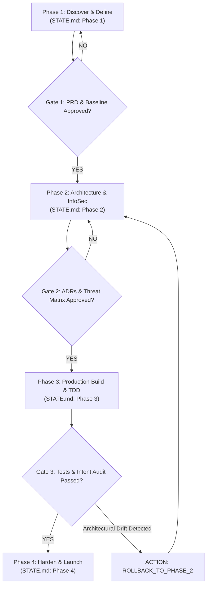

# End-to-End Delivery Walkthrough

This document illustrates the 7-phase software delivery workflow applied to a real-world project: building a **Multimodal AI Real Estate Concierge Agent**.

The project is orchestrated using meta-skills:
* **[`e2e-delivery-workflow`](https://github.com/enriquekalven/delta-skills/tree/main/skills/e2e-delivery-workflow)** (7-Phase SDLC Orchestrator)
* **[`tdl-field-guide`](https://github.com/enriquekalven/delta-skills/tree/main/skills/tdl-field-guide)** (12-Week TDL Operational Playbook)

---

## Sample Use Case: Multimodal Real Estate Concierge Agent
* **Domain**: Real Estate investment underwriting.
* **Objective**: Automate deal underwriting with an ADK Agent running on Google Cloud that ingests PDFs and endpoints, calculates cap rates, and responds via text/voice.

---

## Invoking the Meta-Skill

Initiate the agent conversation using the meta-skill trigger:

```bash
"Let's run e2e-delivery-workflow to build the Multimodal Real Estate Concierge Agent."
# OR for TDL enterprise engagements:
"Let's run tdl-field-guide to lead this 12-week Real Estate engagement."
```

---

## Phase Execution Pipeline

The meta-skill reads `STATE.md` in the project root, resolves active capability slots, executes phase tasks, and stops for gate sign-off before updating state.


```mermaid
graph TD
    P1["Phase 1: Discover & Define<br/>(STATE.md: Phase 1)"] --> Gate1{"Gate 1: PRD & Baseline Approved?"}
    Gate1 -- "YES" --> P2["Phase 2: Architecture & InfoSec<br/>(STATE.md: Phase 2)"]
    Gate1 -- "NO" --> P1
    P2 --> Gate2{"Gate 2: ADRs & Threat Matrix Approved?"}
    Gate2 -- "YES" --> P3["Phase 3: Production Build & TDD<br/>(STATE.md: Phase 3)"]
    Gate2 -- "NO" --> P2
    P3 --> Gate3{"Gate 3: Tests & Intent Audit Passed?"}
    Gate3 -- "YES" --> P4["Phase 4: Harden & Launch<br/>(STATE.md: Phase 4)"]
    Gate3 -- "Architectural Drift Detected" --> Rollback["ACTION: ROLLBACK_TO_PHASE_2"]
    Rollback --> P2
```

---

## Phase Walkthrough

### Phase 1: Idea Refinement & Solution Scoping
* **State Check**: `STATE.md` set to `Phase 1: Discover & Define`.
* **Meta-Skill Actions**: Orchestrates `#CAPABILITY: Idea-Refinement`, `#CAPABILITY: Opportunity-Mapping`, and `#CAPABILITY: PRD-Creation`.
* **Resolved Tools**:
  * [`idea-refine`](https://github.com/addyosmani/agent-skills/tree/main/skills/idea-refine) — Refines text/voice ingestion concepts.
  * [`opportunity-solution-tree`](https://github.com/phuryn/pm-skills/tree/main/pm-product-discovery/skills/opportunity-solution-tree) — Connects ROI target to feature backlog.
  * [`create-prd`](https://github.com/phuryn/pm-skills/tree/main/pm-execution/skills/create-prd) — Generates PRD with explicit Goals and Non-Goals.
* **Synthetic Baseline**: Audits 50 historical deal files to generate `baseline_kpis.json`.
* **Phase 1 Gate**: Meta-Skill presents `PRD.md` and `baseline_kpis.json` and stops. Reply `"Approved"` to advance `STATE.md` to Phase 2.

### Phase 2: Technical Architecture & System Design
* **State Check**: `STATE.md` updated to `Phase 2: Prototype & Validate`.
* **Meta-Skill Actions**: Orchestrates `#CAPABILITY: Architecture-Grilling`, `#CAPABILITY: API-Design`, and `#CAPABILITY: InfoSec-Threat-Modeling`.
* **Resolved Tools**:
  * [`grill-with-docs`](https://github.com/mattpocock/skills/tree/main/skills/engineering/grill-with-docs) — Reviews Cap Rate module seams, producing `CONTEXT.md` and ADRs.
  * [`api-and-interface-design`](https://github.com/addyosmani/agent-skills/tree/main/skills/api-and-interface-design) — Enforces clean Python ADK boundaries.
  * `threat-model-analyst` — Generates STRIDE threat matrix for InfoSec review.
* **Phase 2 Gate**: Meta-Skill presents ADRs and InfoSec matrix and stops. Reply `"Approved"` to advance `STATE.md` to Phase 3.

### Phase 3: Production Build & TDD
* **State Check**: `STATE.md` updated to `Phase 3: Production Build`.
* **Meta-Skill Actions**: Orchestrates `#CAPABILITY: Task-Breakdown`, `#CAPABILITY: TDD`, and `#CAPABILITY: Intent-Audit`.
* **Resolved Tools**:
  * [`planning-and-task-breakdown`](https://github.com/addyosmani/agent-skills/tree/main/skills/planning-and-task-breakdown) — Decomposes PRD into prioritized tasks.
  * [`test-driven-development`](https://github.com/addyosmani/agent-skills/tree/main/skills/test-driven-development) — Drives Red-Green-Refactor test cycle for calculations:
    ```python
    def test_cap_rate_calculation():
        inputs = {"purchase_price": 1000000, "net_operating_income": 80000}
        assert compute_cap_rate(inputs) == 0.08
    ```
  * [`intended-vs-implemented`](https://github.com/phuryn/pm-skills/tree/main/pm-ai-shipping/skills/intended-vs-implemented) — Audits implementation against PRD intent.
* **Regression Loop Example**: If `intended-vs-implemented` identifies data leakage across unauthorized endpoints, the meta-skill triggers `ACTION: ROLLBACK_TO_PHASE_2` in `STATE.md` to re-architect boundaries.
* **Phase 3 Gate**: Meta-Skill presents 100% passing test suite and stops. Reply `"Approved"` to advance `STATE.md` to Phase 4.

### Phase 4: Harden & Launch
* **State Check**: `STATE.md` updated to `Phase 4: Harden & Launch`.
* **Meta-Skill Actions**: Orchestrates `#CAPABILITY: Agent-Evaluation`, `#CAPABILITY: ROI-Sizing`, and `#CAPABILITY: Handoff-Artifacts`.
* **Resolved Tools**:
  * [`google-agents-cli-eval`](https://github.com/google/agents-cli/tree/main/skills/google-agents-cli-eval) — Executes regression evaluation benchmarks.
  * `ai-value-sizing` — Compares post-deployment accuracy against `baseline_kpis.json`.
  * [`shipping-and-launch`](https://github.com/addyosmani/agent-skills/tree/main/skills/shipping-and-launch) — Deploys to Cloud Run with rollback protocols.
  * [`shipping-artifacts`](https://github.com/phuryn/pm-skills/tree/main/pm-ai-shipping/skills/shipping-artifacts) — Compiles `architecture.md`, `flows.md`, and `variables.md`.
* **Phase 4 Gate**: Meta-Skill delivers Cloud Run URL, ROI Dashboard, and handoff documentation packet.
