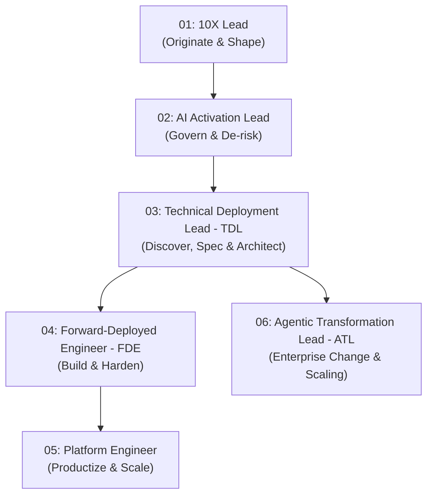
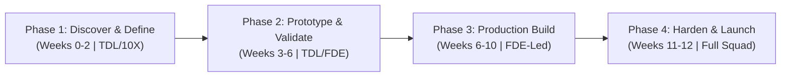

# [Delta] Technical Deployment Lead (TDL) User Guide

**Summary**: This document establishes the definitive operational blueprint and user guide for the Technical Deployment Lead (TDL) role within Google Cloud. It codifies how TDLs leverage standardized, streamlined agent skills to architect, deploy, and prove the business value of mission-critical AI solutions for enterprise clients within a non-negotiable 12-week window.

* **Author**: Enrique Chan (Technical Deployment Lead)
* **Contributors**: Delta TDL Practice, Delta /Forward Engineering Team
* **Reviewers**: Ryan Faris (Agentic Transformation), Delta Squad Governance Board
* **Status**: Active (Definitive Streamlined Edition)
* **Last Revised**: July 21, 2026
* **Context**: `go/welcome-to-delta` | `go/tdl-fde-pm-mindset` | `go/delta-skills`

---

## Overview

Anthropic, OpenAI, and Google Cloud are all scaling Technical Deployment Lead (TDL) capabilities to bridge frontier model capabilities into enterprise workflows.

The Technical Deployment Lead (TDL) within a Delta Squad model is a high-impact, hybrid engineering leadership role sitting squarely at the intersection of deep software architecture, cross-functional orchestration, and enterprise customer strategy.

While individual contributor **Forward Deployed Engineers (FDEs)** write bespoke integration code and connect APIs, the **TDL** owns the overall technical architecture, engineering backlog, scoping boundaries, InfoSec risk mitigation, and ultimate deployment reliability of high-stakes agentic systems.

---

## 1. Core DNA & Archetype

A Delta TDL is **"ops-heavy and architecturally deep."** They move fluidly between system-level abstraction and execution-level detail.

* **The Archetype**: A highly technical systems architect with an "ops-first" mindset. TDLs run executive alignment briefings with C-suite sponsors at 9:00 AM, and pressure-test a cyclic graph architecture or ADK tool schema with a client’s Principal Infrastructure Architect at 10:00 AM.
* **The Environment**: Highly ambiguous, fast-paced, and customer-facing. TDLs are deployed alongside Delta Squads to early "design partners" among prioritized enterprise accounts. They handle the complex 0 → 1 transition—moving frontier Gemini models into hardened production workflows before a standardized playbook even exists.
* **Success Metrics**:
  1. **Delivery Reliability**: Low reopen/churn rates on shipped agentic workflows.
  2. **Operating Leverage**: Extracting reusable code modules, SKILL.md manifests, and playbooks to scale subsequent deployments.
  3. **Measurable Value Realization**: Reporting clear pre- and post-deployment ROI to executive sponsors via metric-backed evaluations.

---

## 2. The Delta /Forward Operating Model & Ecosystem Architecture

The Delta /Forward squad closes the widening chasm between frontier AI capabilities and an enterprise’s operational reality (Enterprise SSO, legacy ETL, regulated data, and InfoSec review boards).

### 2.1 Structural Vector: FDE Squads vs. Traditional PSO / GCC

| Structural Vector | Traditional Project-Based Model (GCC / PSO) | Forward-Deployed Squad (Delta /Forward) |
|---|---|---|
| **Commercial Foundation** | **SOW-Based**: Predefined, rigid scope focusing on fixed infrastructure deliverables. | **MOU / Agile Partnership**: Flexible, value-driven engagement maximizing agentic impact within a fixed 12-week window. |
| **Team Composition** | **Scoped Experts**: Static team size and skills estimated upfront based on SOW tasks. | **Flexible Staffing**: Core squad diagnoses use cases; specialized talent scales dynamically. |
| **Timeline & Focus** | **Broad / Long-Term**: 16+ weeks covering general GCP cloud infrastructure. | **Rapid / Agentic**: Strictly capped at ≤12 weeks, targeted exclusively on deploying production-ready agentic solutions. |
| **Scope Governance** | Contractual change orders required for scope adjustments. | **Strict '1-In, 1-Out' Trade-off Governance**: Backlog changes swap equivalent RICE-scored items. |
| **Primary Metric** | Completion of contractual tasks and closed tickets. | **Production Adoption & Value Realization**: Measured by actual workflow change and verified ROI. |

---

### 2.2 The 6-Role Squad Matrix

The Delta /Forward model relies on a synchronized 6-role matrix:



1. **10X Lead (Originate · Innovate · Shape)**: Arrives early to shape the vertical narrative, partnering with Sales to qualify high-leverage opportunities that move client EBITDA.
2. **AI Activation Lead - AIAL (Govern · De-risk · Expand)**: Owns overall program governance, manages executive alignment, secures client sign-offs, and shields squad execution velocity.
3. **Technical Deployment Lead - TDL (Discover · Redesign · Prototype)**: Deeply immerses into client domains, redesigns legacy workflows into agentic pipelines, writes specs, builds prototypes, and designs evaluation criteria.
4. **Forward-Deployed Engineer - FDE (Build · Integrate · Operate)**: Takes the TDL's validated prototype, anchors it inside the customer's real environment, hardens enterprise integrations, and establishes production evaluation pipelines.
5. **Platform Engineer (Productize · Accelerate · Scale)**: Shifts technical complexity into shared infrastructure by creating "Golden Paths," reusable agent components, and CI/CD observability patterns.
6. **Agentic Transformation Lead - ATL (Transform · Scale · Enable)**: *Led under Ryan Faris.* Owns enterprise organizational change management (OCM), business-unit enablement, and C-suite change velocity, ensuring client staff adopt shipped agentic workflows at scale.

---

### 2.3 The 12-Week Agentic Transformation Lifecycle



---

## 3. Streamlined Delta Skills Hub (14 Core Primitives)

Skills are distributed via the **Unified Delta Skills Hub (`go/delta-skills`)**, exposed natively through `agy plugin install` (Antigravity), `agents-cli update` (Agent CLI), and automated `.agents/skills` symlinks for Cursor/Claude Code environments.

```
┌────────────────────────────────────────────────────────────────────────┐
│                   STREAMLINED DELTA TDL SKILL STACK                    │
├───────────────────┬───────────────────────────────────┬────────────────┤
│ Phase             │ Primary Skill & Source            │ Key Function   │
├───────────────────┼───────────────────────────────────┼────────────────┤
│ Phase 1: Discovery│ workshop-intake (delta-skills)    │ Customer Intake│
│                   │ opportunity-solution-tree (PM)    │ Scope Mapping  │
│                   │ create-prd (PM)                   │ PRD & Metrics  │
├───────────────────┼───────────────────────────────────┼────────────────┤
│ Phase 2: Architect│ grill-with-docs (MP)              │ ADRs & Seams   │
│                   │ api-and-interface-design (AO)     │ API Contracts  │
│                   │ threat-model-analyst (Copilot)    │ STRIDE-A InfoSec│
├───────────────────┼───────────────────────────────────┼────────────────┤
│ Phase 3: Build/QA │ planning-and-task-breakdown (AO)  │ Task Breakdown │
│                   │ test-driven-development (AO/MP)   │ Red-Green TDD  │
│                   │ intended-vs-implemented (PM)      │ Intent Audit   │
│                   │ code-review-and-quality (AO/FDE)  │ 5-Axis Review  │
├───────────────────┼───────────────────────────────────┼────────────────┤
│ Phase 4: Launch   │ google-agents-cli-eval (G)        │ Eval-on-Commit │
│                   │ ai-value-sizing (delta-skills)    │ ROI Dashboard  │
│                   │ shipping-and-launch (AO)          │ Release Plan   │
│                   │ shipping-artifacts (PM)           │ Handoff Packet │
└───────────────────┴───────────────────────────────────┴────────────────┘
```

---

## 4. Operating Playbook for Field Engagements

### Phase 1 (Weeks 0-2): Alignment, Discovery & Ambiguity Reduction
1. **Kickoff & Framing**: Invoke `workshop-intake` to map corporate constraints and extract core business drivers.
2. **Opportunity Mapping**: Deploy `opportunity-solution-tree` to connect desired business outcomes to concrete agent features.
3. **Synthetic Baseline Protocol**: Execute a 50-sample retrospective audit of historical tickets/documents with client SMEs to establish manual time and unit costs, outputting `baseline_kpis.json`.
4. **The Week 2 Gate**: Trigger `create-prd` to freeze the Phase 1 PRD spec with explicit Goals and Non-Goals.

### Phase 2 (Weeks 3-6): Architectural Hardening & InfoSec Clearance
1. **Architectural Grilling**: Execute `grill-with-docs` over the proposed workflow to resolve dependencies and generate ADRs and `CONTEXT.md`.
2. **Interface Contracting**: Trigger `api-and-interface-design` to enforce deep module seams.
3. **Threat Modeling & InfoSec**: Run `threat-model-analyst` (STRIDE-A) and `security-and-hardening` before entering the client InfoSec review board.

### Phase 3 (Weeks 6-10): Sprint Orchestration & Execution (Core Build)
1. **Task Decomposition**: Trigger `planning-and-task-breakdown` and `to-tickets` to sequence RICE-prioritized user stories.
2. **Scope Control**: Enforce **Strict '1-In, 1-Out' Trade-off Governance**. Mid-flight feature requests require swapping an equal-effort RICE item or shifting it post-Week 12.
3. **TDD & Code Quality**: Require FDEs to drive `test-driven-development` and validate pull requests locally using `code-review-and-quality`.
4. **Environment Policy Gate**: Enforce automated AST checks and `dummy-dataset` scrubbers to ensure customer PII/PHI is never uploaded to non-production Argolis or GTM FDE test projects.

### Phase 4 (Weeks 11-12): Quality Gating, Value Realization & GTM
1. **Intent & Regression Audit**: Run `intended-vs-implemented` to detect boundary drift, and enforce `google-agents-cli-eval` on every commit.
2. **Production Rollout**: Execute `shipping-and-launch` and `google-agents-cli-deploy` to generate launch manifests with rollback protocols.
3. **ROI Measurement**: Deploy `ai-value-sizing` comparing live metrics against `baseline_kpis.json` to prove C-suite EBITDA impact.
4. **Commercial Expansion & Handoff**: Compile `shipping-artifacts` for client platform team handoff, and publish solution patterns via `google-agents-cli-publish`.

---

## 5. FDE Environments & Compliance Guardrails

```
┌────────────────────────────────────────────────────────────────────────┐
│                        FDE ENVIRONMENT MATRIX                          │
├───────────────────┬───────────────────────────────┬────────────────────┤
│ Environment       │ Permitted Workload            │ Data Rule          │
├───────────────────┼───────────────────────────────┼────────────────────┤
│ GTM FDE Projects  │ Rapid PoCs / Internal EAP     │ NO CUSTOMER DEMOS  │
│ Argolis / GCP     │ Customer Demo Solutions       │ Scrubbed / Mocks   │
│ go/demos          │ Sales & Internal Initiatives  │ Standardized Demos │
│ Client VPC        │ Phase 3 Build & Production    │ Real Data Allowed  │
└───────────────────┴───────────────────────────────┴────────────────────┘
```

* **Internal EAP Projects**: Use GTM FDE 20 projects (`go/fde-project-guide`). Strictly for learning/testing EAP features. **No customer demos permitted.**
* **Customer Demos**: Use Argolis or dedicated GCP projects with scrubbed/synthetic data.
* **Production Build**: Executed exclusively inside the client's tenant/VPC environment with `security-and-hardening` enforcement.
