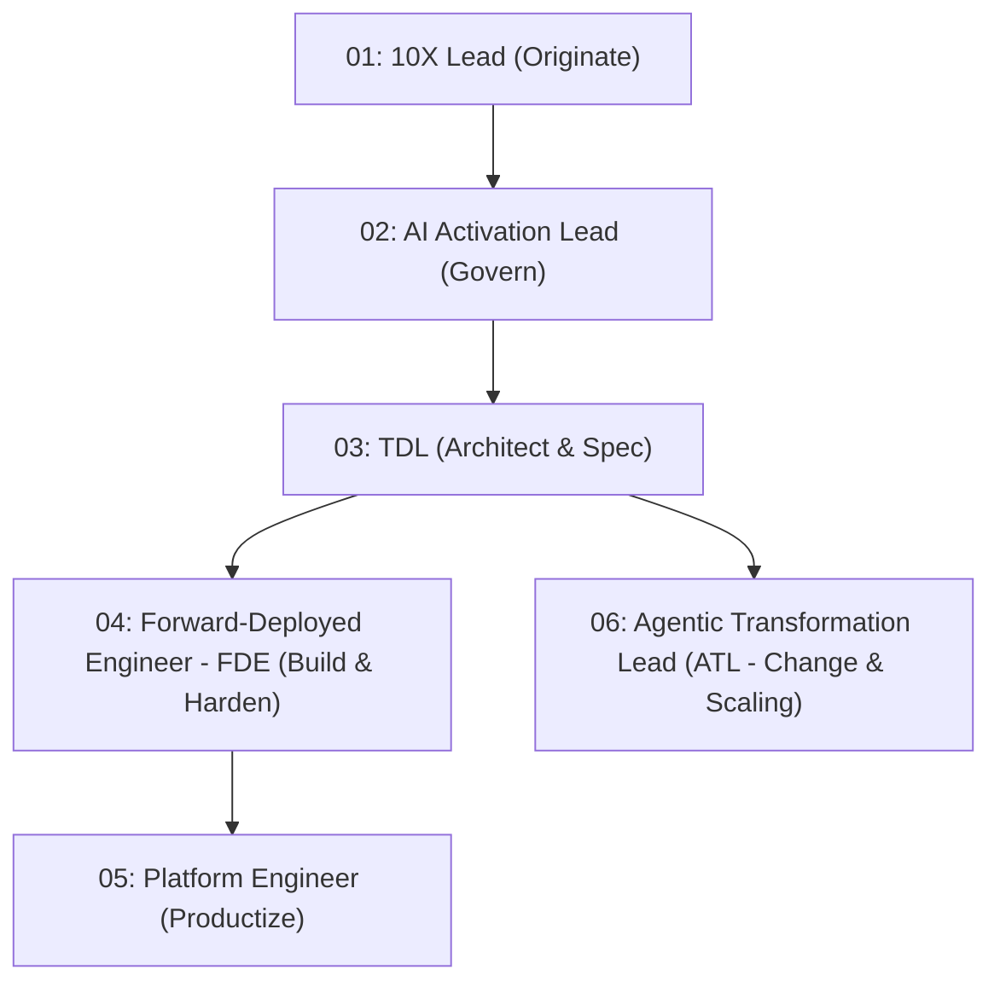

# Technical Deployment Lead (TDL) Field Execution User Guide

> **Google Cloud Delta Squad Operational Field Handbook**

This handbook provides Technical Deployment Leads (TDLs), Forward Deployed Engineers (FDEs), and AI Activation Leads (AIALs) with step-by-step guidance for managing 12-week enterprise customer engagements using the `delta-skills` meta-skill suite.

---

## 1. Engagement Overview & Squad Matrix

Every 12-week enterprise Delta engagement is governed by a 6-role squad matrix:

```mermaid
graph TD
    A["01: 10X Lead (Originate)"] --> B["02: AI Activation Lead (Govern)"]
    B --> C["03: TDL (Architect & Spec)"]
    C --> D["04: Forward-Deployed Engineer - FDE (Build & Harden)"]
    D --> E["05: Platform Engineer (Productize)"]
    C --> F["06: Agentic Transformation Lead (ATL - Change & Scaling)"]
```

### Core TDL Governance Policies
1. **12-Week Capped Window**: Non-negotiable target delivery milestone.
2. **1-in, 1-out Scope Governance**: Mid-flight feature additions swap equal RICE-scored backlog items.
3. **Synthetic Baseline Protocol**: Execute a 50-sample retrospective SME audit in Week 2 producing `baseline_kpis.json`.
4. **Environment Segregation Policy**: Internal PoCs/staging run on sanitized dummy datasets (`dummy-dataset`); production deploys strictly in the client VPC.

---

## 2. Master Capability Slot Matrix

The TDL playbook dynamically resolves runtime capabilities across 4 phases:

| Phase | Capability Slot | Primary Skill | Extended / Secondary Skill | Output Artifact |
|---|---|---|---|---|
| **Phase 1** | `#CAPABILITY: Skill-Stocktake` | `skill-stocktake` | `using-agent-skills` | `docs/SKILL_STOCKTAKE.md` |
| **Phase 1** | `#CAPABILITY: Codebase-Onboarding` | `codebase-onboarding-and-mapping` | `graphify` (AST Knowledge Graph) | `docs/ONBOARDING.md` |
| **Phase 1** | `#CAPABILITY: Repo-Conventions` | `ecc-repo-conventions` | `git-workflow-and-versioning` | Standard layout & `STATE.md` |
| **Phase 1** | `#CAPABILITY: Customer-Intake` | `workshop-intake` | `interview-me` | Intake notes & scope |
| **Phase 1** | `#CAPABILITY: Scope-Mapping` | `opportunity-solution-tree` | `user-stories`, `job-stories` | Opportunity solution tree |
| **Phase 1** | `#CAPABILITY: PRD-Creation` | `create-prd` | `spec-driven-development` | `docs/PRD.md` |
| **Phase 1** | `#CAPABILITY: Baseline-Audit` | `synthetic-baseline-protocol` | `ai-value-sizing` | `docs/baseline_kpis.json` |
| **Phase 2** | `#CAPABILITY: GCP-Architecture-Advisor`| `gcp-agent-architecture-advisor` | `grill-with-docs` | `docs/ARCHITECTURE_RECOMMENDATION.md` |
| **Phase 2** | `#CAPABILITY: Executive-Persona-Review`| `gstack` (Eng Manager & Doc Personas) | `strategy-red-team` | Pre-gate audit report |
| **Phase 2** | `#CAPABILITY: Tech-Design-Document` | `documentation-and-adrs` | `spec-driven-development` | `docs/TDD.md` |
| **Phase 2** | `#CAPABILITY: API-Design` | `api-and-interface-design` | `domain-modeling`, `codebase-design` | API contract & module seams |
| **Phase 2** | `#CAPABILITY: InfoSec-Threat-Modeling`| `threat-model-analyst` | `security-and-hardening` | `docs/THREAT_MATRIX.md` |
| **Phase 3** | `#CAPABILITY: Fleet-Management` | `agentic-engineering` | `caveman` (Token compression) | Subagent model routing |
| **Phase 3** | `#CAPABILITY: Task-Breakdown` | `planning-and-task-breakdown` | `to-tickets` | RICE backlog |
| **Phase 3** | `#CAPABILITY: TDD-Build` | `test-driven-development` | `superpowers` (TDD framework) | Passing unit tests |
| **Phase 3** | `#CAPABILITY: Code-Simplification` | `ponytail` | `code-simplification` | Clean deep interfaces |
| **Phase 3** | `#CAPABILITY: Intent-Audit` | `intended-vs-implemented` | `sql-queries` | Intent gap audit report |
| **Phase 3** | `#CAPABILITY: Code-Review` | `code-review-and-quality` | `pso-code-quality-reviewer` | Code review sign-off |
| **Phase 4** | `#CAPABILITY: Agent-Evaluation` | `google-agents-cli-eval` | `eval-quality-gate` | Eval regression suite |
| **Phase 4** | `#CAPABILITY: ROI-Sizing` | `ai-value-sizing` | `cohort-analysis`, `ab-test-analysis` | ROI dashboard report |
| **Phase 4** | `#CAPABILITY: Release-Deployment` | `shipping-and-launch` | `google-agents-cli-deploy` | Cloud Run / GKE deploy |
| **Phase 4** | `#CAPABILITY: Handoff-Artifacts` | `shipping-artifacts` | `release-notes` | `shipping-artifacts` packet |

---

## 3. Phase-by-Phase TDL Step-by-Step Guide

### Phase 1: Discover & Define (Weeks 0-2)
1. **Initialize State**: Verify `STATE.md` is initialized to `Phase 1: Discover & Define`.
2. **Run Skill Stocktake**: Execute `skill-stocktake` to verify all required capability slots are active.
3. **Onboard Codebase**: Execute `codebase-onboarding-and-mapping` and `graphify` to map AST dependencies, DB schema edges, and routes into `docs/ONBOARDING.md`.
4. **Audit Baseline KPIs**: Conduct a 50-sample SME audit using `synthetic-baseline-protocol` to generate `baseline_kpis.json`.
5. **Draft PRD**: Execute `create-prd` to lock in Goals, Non-Goals, and value metrics.
6. **Phase 1 Gate Check**: Present `PRD.md` and `baseline_kpis.json` for sponsor sign-off.

### Phase 2: Prototype & Validate (Weeks 3-6)
1. **Architect GCP Solution**: Execute `gcp-agent-architecture-advisor` to compare No-Code, Low-Code, and High-Code ADK tiers and output `docs/ARCHITECTURE_RECOMMENDATION.md`.
2. **Design Interfaces**: Execute `api-and-interface-design` to lock in module seams.
3. **Run Executive Persona Review**: Run `gstack` personas (Eng Manager & Doc Engineer) to audit technical trade-offs prior to presenting gate review.
4. **Model InfoSec Threats**: Run `threat-model-analyst` to compile the STRIDE threat matrix.
5. **Scaffold ADK Agent**: Run `google-agents-cli-scaffold` and `google-agents-cli-adk-code`.
6. **Phase 2 Gate Check**: Present Architecture Recommendation and InfoSec matrix for InfoSec board approval.

### Phase 3: Production Build (Weeks 6-10)
1. **Configure Subagent Fleet**: Execute `agentic-engineering` and `caveman` token compression rules for model routing.
2. **Drive TDD Iteration**: Execute `test-driven-development` and `superpowers` to build core features test-first.
3. **Simplify Implementation**: Run `ponytail` and `code-simplification` to eliminate unnecessary abstractions and boilerplate.
4. **Audit Intent vs Code**: Execute `intended-vs-implemented` to detect architectural drift.
5. **Handle Regression Rollbacks**: If architectural defects are uncovered, update `STATE.md` to `ACTION: ROLLBACK_TO_PHASE_2`.
6. **Phase 3 Gate Check**: Verify 100% test pass rate and zero intent gaps.

### Phase 4: Harden & Launch (Weeks 11-12)
1. **Execute Agent Evaluation**: Run `google-agents-cli-eval` regression suites.
2. **Prove ROI**: Run `ai-value-sizing` comparing post-deployment accuracy against `baseline_kpis.json`.
3. **Deploy Service**: Run `shipping-and-launch` and `google-agents-cli-deploy` for Cloud Run/GKE deployment.
4. **Compile Handoff Packet**: Run `shipping-artifacts` to generate `architecture.md`, `flows.md`, and `variables.md`.
5. **Phase 4 Gate Check**: Deliver live Cloud Run URL, ROI Dashboard, and handoff documentation packet.
