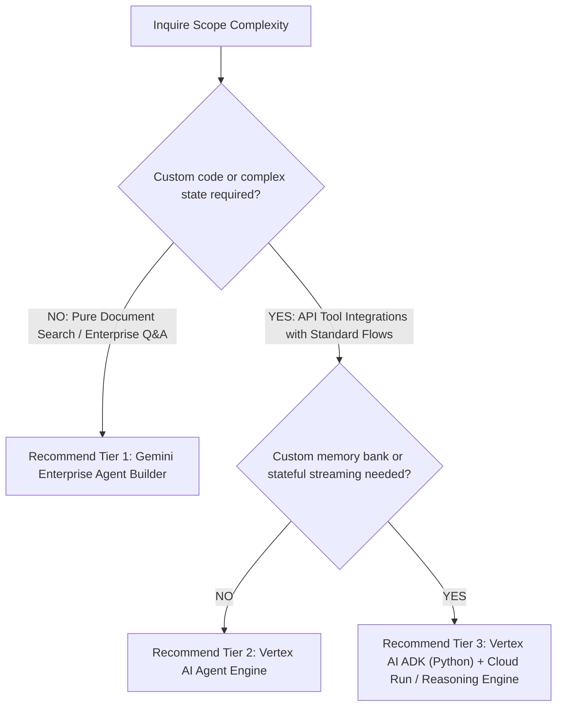

# Google Cloud Agent Architecture Advisor

Evaluates project requirements (PRD and workshop intake notes) and synthesizes an architectural recommendation for AI Agent systems on Google Cloud.

---

## 3-Tier Google Cloud Agent Architecture Spectrum

```
┌─────────────────────────────────┐
│ Tier 1: No-Code / Low-Code     │ --> Gemini Enterprise Agent Builder / Vertex AI Search & Conversation
├─────────────────────────────────┤
│ Tier 2: Managed Low-Code        │ --> Vertex AI Agent Engine & Builder Extensions
├─────────────────────────────────┤
│ Tier 3: High-Code Custom        │ --> Vertex AI ADK (Python), Reasoning Engine, Cloud Run, GKE
└─────────────────────────────────┘
```

### Tier Comparison Matrix

| Tier | Primary Framework | Ideal Use Case | Cost Model | Customization | Ops Overhead |
|---|---|---|---|---|---|
| **Tier 1 (No-Code)** | Gemini Enterprise Agent Builder | Standard enterprise Q&A, knowledge base search, zero custom code needed. | Per-query / SaaS | Low | Minimal |
| **Tier 2 (Low-Code)** | Vertex AI Agent Engine | Pre-built agent orchestration with custom API tool extensions. | Consumption | Medium | Low |
| **Tier 3 (High-Code)** | Vertex AI ADK (Python) + Cloud Run | Complex multi-step reasoning, custom memory banks, stateful streaming, fine-grained telemetry. | Compute + Model Tokens | Maximum | Medium |

---

## Feature Release Maturity Matrix (Google Cloud AI Agent Stack)

| Component / Feature | Release Status | Recommended For Production? | Notes / Constraints |
|---|---|---|---|
| **Vertex AI Reasoning Engine** | **GA** | Yes | Production-grade execution environment for Python agent code. |
| **Chirp 3 HD Audio** | **GA** | Yes | High-fidelity voice streaming and multilingual speech-to-speech. |
| **Vertex AI ADK (`@google/adk`)** | **GA** | Yes | Primary SDK for high-code Python and TypeScript agents. |
| **Vertex AI Agent Engine** | **Public Preview** | Yes (With SLA Awareness) | Managed agent runtime; subject to Preview terms. |
| **Agent Gateway** | **Public Preview** | Staging / Pilot | Policy enforcement & tool proxy for multi-agent fleets. |

---

## Architecture Evaluation Protocol

### Step 1: Input Analysis
Ingest the project's `PRD.md` and intake notes/transcripts (`workshop_notes.txt` or `docs/CONTEXT.md`). Extract:
- Functional complexity (deterministic workflows vs autonomous reasoning).
- Security & compliance boundaries (VPC-SC, PHI/HIPAA, CMEK).
- Integration requirements (SaaS connectors, REST APIs, custom gRPC).
- SME maintenance capacity (engineering team vs business analyst team).

### Step 2: Tier Selection Rationale
Weigh options across the 3 tiers using the decision tree:



### Step 3: Artifact Generation
Output the detailed recommendation to `docs/ARCHITECTURE_RECOMMENDATION.md`.

---

## Recommendation Document Schema (`docs/ARCHITECTURE_RECOMMENDATION.md`)

```markdown
# Google Cloud Agent Architecture Recommendation

## 1. Executive Summary
- Recommended Tier: [Tier 1 / Tier 2 / Tier 3]
- Core Stack: [e.g., Vertex AI ADK Python + Reasoning Engine + Cloud Run]
- Key Rationale: [2-3 sentences summarizing cost, speed, and flexibility trade-offs]

## 2. Architecture Comparison & Trade-Off Analysis
| Criterion | Tier 1 (No-Code) | Tier 2 (Low-Code) | Tier 3 (High-Code) | Selected |
|---|---|---|---|---|
| Customizability | Low | Medium | High | ✓ |
| Development Velocity | 1-2 days | 1-2 weeks | 3-6 weeks | |
| Ops & Security Overhead | Low | Low | Medium | |

## 3. Product Feature & Release Status Mapping
- Component A: Status [GA / Preview] -> Rationale
- Component B: Status [GA / Preview] -> Rationale

## 4. Target System Architecture Topology
[Mermaid Diagram of user request -> Agent -> Tools -> GCP Services]
```
