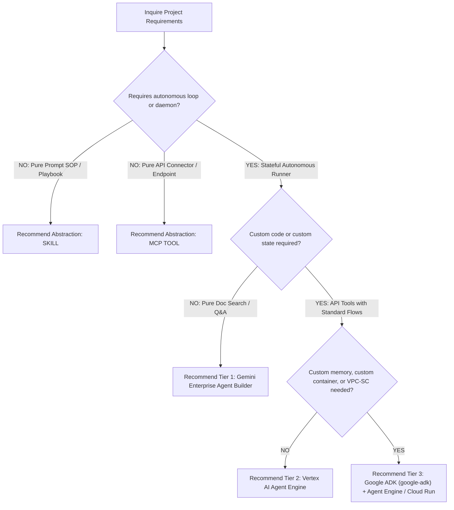

# Google Cloud Agent Architecture Advisor

Evaluates project requirements (PRD and workshop intake notes) and synthesizes a rigorous architectural recommendation across two dimensions:
1. **Abstraction Level Selection**: Skill vs. MCP Tool vs. Autonomous Agent.
2. **Google Cloud Infrastructure Spectrum**: Tier 1 (No-Code) vs. Tier 2 (Low-Code) vs. Tier 3 (High-Code ADK).

---

## 1. Abstraction Selection: Skill vs. MCP Tool vs. Autonomous Agent

Before evaluating cloud runtime infrastructure, determine the primary architectural artifact required:

| Abstraction Level | Primary Purpose | When to Choose | Example Output |
| :--- | :--- | :--- | :--- |
| **Skill** | Standard Operating Procedure (SOP), prompt playbook, or multi-step prompt workflow. | Execution occurs within an existing agent/LLM assistant session; no independent daemon or runtime host required. | `SKILL.md` file in `.agents/skills/` |
| **MCP Tool** | Schema-driven API connector or data resource wrapper. | Exposing data endpoints, database access, or local tools for consumption by external agent fleets via Model Context Protocol. | `mcp_config.json` + MCP Server script |
| **Autonomous Agent** | Independent stateful application with multi-turn planning loops. | Requires background daemon execution, custom state/memory persistence, asynchronous callbacks, or autonomous multi-tool routing. | ADK Agent app (`google-adk`) / Cloud Run Service |

---

## 2. 3-Tier Google Cloud Agent Architecture Spectrum

```
┌─────────────────────────────────┐
│ Tier 1: No-Code / SaaS         │ --> Gemini Enterprise Agent Builder / Vertex AI Search & Conversation
├─────────────────────────────────┤
│ Tier 2: Managed Low-Code        │ --> Vertex AI Agent Engine (Builder & OpenAPI Extensions)
├─────────────────────────────────┤
│ Tier 3: High-Code Custom ADK    │ --> Google ADK (google-adk) -> Vertex AI Agent Engine / Cloud Run / GKE
└─────────────────────────────────┘
```

### Tier Comparison Matrix

| Criteria | Tier 1: No-Code | Tier 2: Managed Low-Code | Tier 3: High-Code Custom ADK |
| :--- | :--- | :--- | :--- |
| **Primary Framework** | Gemini Enterprise Agent Builder | Vertex AI Agent Engine Extensions | Google ADK (`google-adk` PyPI) |
| **Hosting Target** | Managed GCP SaaS | Vertex AI Managed Agent Runtime | Vertex AI Agent Engine / Cloud Run / GKE |
| **Ideal Use Case** | Enterprise document search, Q&A, zero custom code. | Pre-built agent loops with standard OpenAPI extensions. | Complex multi-step reasoning, stateful streaming, custom memory banks. |
| **Cost Model** | Per-query / SaaS license | Consumption (Agent Engine invocations) | Compute (vCPU/RAM) + Model API Tokens |
| **Customization** | Low (UI Configuration) | Medium (API extensions & prompts) | Maximum (Full Python code control over loops & state) |
| **Security Perimeter** | Google Managed IAM | VPC-SC & Managed IAM | Custom VPC-SC perimeters, CMEK, Granular IAM |
| **Ops Overhead** | Minimal | Low | Medium (CI/CD, container registry, tracing) |

---

## 3. Hard Decision Thresholds & Security Boundaries

Use these strict technical thresholds to force Tier selection:

### Force Tier 1 (No-Code) if:
- Requirements are 100% document search, internal knowledge base Q&A, or unstructured PDF retrieval.
- Zero custom code, database mutations, or third-party OAuth2 token exchanges are permitted.
- Maintained entirely by non-technical business analysts.

### Force Tier 2 (Managed Low-Code) if:
- Requirements involve standard REST/OpenAPI tool extensions without custom streaming protocols.
- Built-in Vertex AI Agent Engine memory management and tool routing are sufficient.
- Development team prefers serverless managed agent infrastructure without container management.

### Force Tier 3 (High-Code ADK) if:
- **Custom Memory/State**: Requires custom vector databases (AlloyDBpg, Vertex Vector Search) or stateful sessions across turns.
- **Custom Protocols / Sidecars**: Requires custom containers, WebSockets, or bi-directional streaming (e.g. Chirp 3 HD audio / Gemini Multimodal Live).
- **VPC-SC / CMEK Compliance**: Requires strict Customer-Managed Encryption Keys (CMEK) or dedicated VPC Service Controls perimeters.
- **Multi-Agent Orchestration**: Uses complex A2A (Agent-to-Agent) communication graphs or Agent Gateway policy enforcement.

---

## 4. Feature Release Maturity Matrix (Google Cloud AI Stack)

| Component / Feature | Release Status | Production Ready? | Notes & Constraints |
| :--- | :--- | :--- | :--- |
| **Google ADK (`google-adk`)** | **GA** | Yes | Open-source Python agent framework (`google.adk`), model- and runtime-agnostic. |
| **Vertex AI Agent Engine** | **GA** | Yes | Managed serverless agent runtime (formerly known as Reasoning Engine). |
| **Gemini Enterprise Agent Builder** | **GA** | Yes | Enterprise No-Code agent suite for search & conversation. |
| **Agent Gateway** | **Public Preview** | Staging / Pilot | Policy enforcement & tool proxy for multi-agent fleets. |

---

## 5. End-to-End Decision Tree



---

## 6. Architecture Recommendation Artifact Schema (`docs/ARCHITECTURE_RECOMMENDATION.md`)

When executing this skill, output the final evaluation to `docs/ARCHITECTURE_RECOMMENDATION.md`:

```markdown
# Google Cloud Agent Architecture Recommendation

## 1. Abstraction Level Analysis
- **Selected Abstraction**: [Skill / MCP Tool / Autonomous Agent]
- **Rationale**: [1-2 sentences on why this abstraction fits the use case]

## 2. Infrastructure Tier Selection
- **Selected Tier**: [Tier 1 (No-Code) / Tier 2 (Managed Low-Code) / Tier 3 (High-Code ADK)]
- **Core Technology Stack**: [e.g. Google ADK Python (google-adk) + Vertex AI Agent Engine / Cloud Run]
- **Key Decision Triggers**: [List specific technical requirements forcing this tier]

## 3. Architecture Comparison & Trade-Off Matrix
| Criterion | Tier 1 (No-Code) | Tier 2 (Low-Code) | Tier 3 (High-Code ADK) | Selected |
| :--- | :--- | :--- | :--- | :---: |
| Customizability | Low | Medium | High | ✓ |
| Development Velocity | 1-2 days | 1-2 weeks | 3-6 weeks | |
| Ops & Security Overhead | Minimal | Low | Medium | |

## 4. Product Maturity & Risk Mapping
- Component A: Status [GA / Preview] -> Production Approval Rationale
- Component B: Status [GA / Preview] -> Production Approval Rationale

## 5. Target Architecture Topology
[Mermaid Diagram mapping User -> Agent -> Tools -> GCP Services]
```
