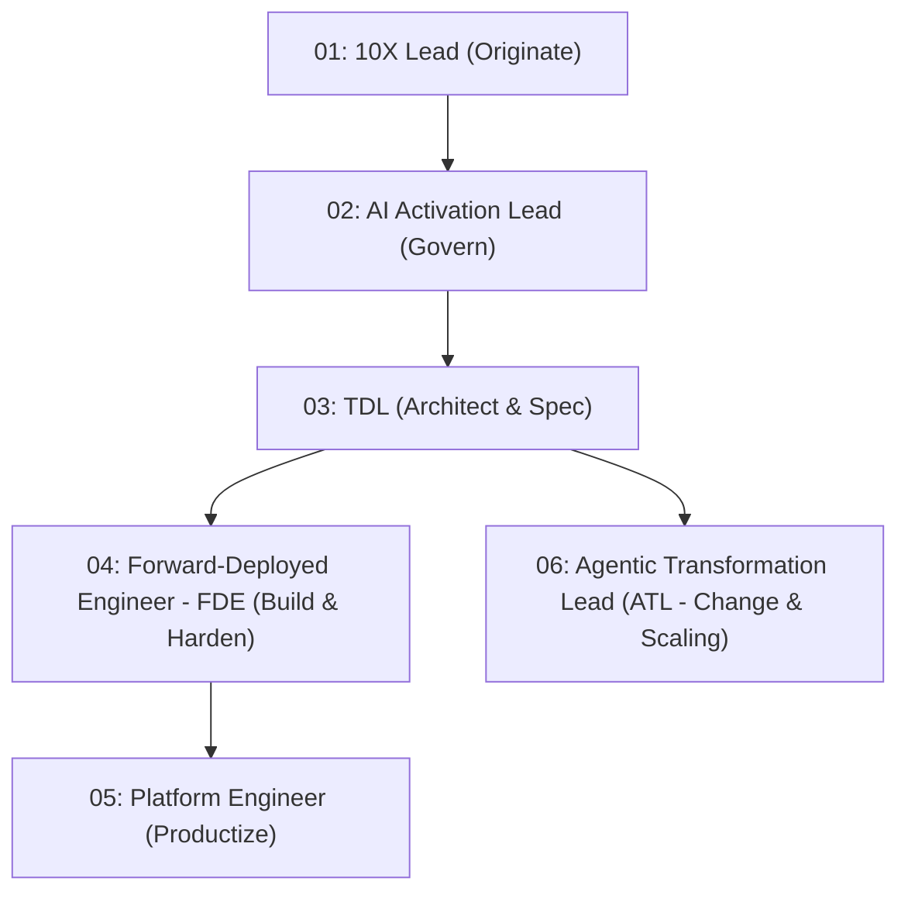

# Technical Deployment Lead (TDL) Field Execution Playbook

Operational execution playbook for Technical Deployment Leads (TDLs) managing 12-week Google Cloud enterprise engagements.

---

## Dynamic Capability Resolution Matrix

```
[Inspect STATE.md] --> [Run Skill Stocktake] --> [Resolve Phase Capability Slots] --> [Execute Gate Verification]
```

### Capability Slot Mapping (Tier 1 & Tier 2)

| Phase | Capability Slot | Primary Tool (Tier 1) | Extended Tools (Tier 2) |
|---|---|---|---|
| **Phase 1** | `#CAPABILITY: Skill-Stocktake` | `skill-stocktake` | `using-agent-skills` |
| **Phase 1** | `#CAPABILITY: Codebase-Onboarding` | `codebase-onboarding-and-mapping` | `codebase-design` |
| **Phase 1** | `#CAPABILITY: Repo-Conventions` | `ecc-repo-conventions` | `git-workflow-and-versioning` |
| **Phase 1** | `#CAPABILITY: Customer-Intake` | `workshop-intake` | `interview-me` |
| **Phase 1** | `#CAPABILITY: Scope-Mapping` | `opportunity-solution-tree` | `user-stories`, `job-stories` |
| **Phase 1** | `#CAPABILITY: PRD-Creation` | `create-prd` | `spec-driven-development` |
| **Phase 2** | `#CAPABILITY: GCP-Architecture-Advisor`| `gcp-agent-architecture-advisor` | `grill-with-docs`, `google-agents-cli-scaffold` |
| **Phase 2** | `#CAPABILITY: Tech-Design-Document` | `documentation-and-adrs` | `spec-driven-development` |
| **Phase 2** | `#CAPABILITY: API-Design` | `api-and-interface-design` | `domain-modeling`, `codebase-design` |
| **Phase 2** | `#CAPABILITY: InfoSec-Threat-Modeling`| `threat-model-analyst` | `google-cloud-waf-security`, `agent-governance`, `security-and-hardening` |
| **Phase 3** | `#CAPABILITY: Fleet-Management` | `agentic-engineering` | `context-engineering` |
| **Phase 3** | `#CAPABILITY: Task-Breakdown` | `planning-and-task-breakdown` | `to-tickets`, `feature-tracking` |
| **Phase 3** | `#CAPABILITY: TDD-Build` | `test-driven-development` | `implement`, `source-driven-development`, `ast-resilient-remediation` |
| **Phase 3** | `#CAPABILITY: Intent-Audit` | `intended-vs-implemented` | `sql-queries` (pipeline validation) |
| **Phase 3** | `#CAPABILITY: Code-Review` | `code-review-and-quality` | `pso-code-quality-reviewer`, `code-simplification` |
| **Phase 4** | `#CAPABILITY: Agent-Evaluation` | `google-agents-cli-eval` | `eval-quality-gate` |
| **Phase 4** | `#CAPABILITY: ROI-Sizing` | `ai-value-sizing` | `cohort-analysis`, `ab-test-analysis` |
| **Phase 4** | `#CAPABILITY: Release-Deployment` | `shipping-and-launch` | `google-agents-cli-deploy`, `google-agents-cli-publish`, `google-agents-cli-observability` |
| **Phase 4** | `#CAPABILITY: Handoff-Artifacts` | `shipping-artifacts` | `release-notes`, `retro` |

---

## Squad Matrix & Governance Rules


```mermaid
graph TD
    A["01: 10X Lead (Originate)"] --> B["02: AI Activation Lead (Govern)"]
    B --> C["03: TDL (Architect & Spec)"]
    C --> D["04: Forward-Deployed Engineer - FDE (Build & Harden)"]
    D --> E["05: Platform Engineer (Productize)"]
    C --> F["06: Agentic Transformation Lead (ATL - Change & Scaling)"]
```

### Core Governance Rules
* **12-Week Capped Window**: Fixed milestone target window.
* **1-in, 1-out Scope Governance**: Mid-flight feature requests swap equivalent RICE-scored items.
* **Synthetic Baseline Protocol**: Execute 50-sample retrospective SME audit in Phase 1 producing `baseline_kpis.json`.
* **Environment Segregation**: Staging PoCs run with sanitized dummy data (`dummy-dataset`); production deploys in client VPC.

---

## Execution Lifecycle

### Phase 1: Discover & Define (Weeks 0-2 | TDL-Led)
* **Actions**: Run `#CAPABILITY: Skill-Stocktake`, `#CAPABILITY: Codebase-Onboarding` (`docs/ONBOARDING.md`), `#CAPABILITY: Repo-Conventions`, `#CAPABILITY: Scope-Mapping`, and `#CAPABILITY: PRD-Creation`. Audit 50 SME samples for `baseline_kpis.json`.
* **Gate Check**: Present `docs/ONBOARDING.md`, `PRD.md`, and `baseline_kpis.json`. Await user sign-off before updating `STATE.md` to Phase 2.

### Phase 2: Prototype & Validate (Weeks 3-6 | TDL + FDE)
* **Actions**: Run `#CAPABILITY: GCP-Architecture-Advisor` (`gcp-agent-architecture-advisor` -> `docs/ARCHITECTURE_RECOMMENDATION.md`), `#CAPABILITY: Tech-Design-Document` (`docs/TDD.md`), `#CAPABILITY: API-Design`, and `#CAPABILITY: InfoSec-Threat-Modeling`.
* **ADK Agent Setup**: Invoke `google-agents-cli-scaffold` and `google-agents-cli-adk-code`.
* **Gate Check**: Present Architecture Recommendation (`docs/ARCHITECTURE_RECOMMENDATION.md`) and InfoSec matrix. Await sign-off before updating `STATE.md` to Phase 3.

### Phase 3: Production Build (Weeks 6-10 | FDE-Led)
* **Actions**: Configure `#CAPABILITY: Fleet-Management` (`agentic-engineering`), run `#CAPABILITY: Task-Breakdown`, drive `#CAPABILITY: TDD-Build`, run `#CAPABILITY: Intent-Audit`, and execute `#CAPABILITY: Code-Review`.
* **Regression Loop**: If architectural flaws are discovered, write `ACTION: ROLLBACK_TO_PHASE_2` in `STATE.md`.
* **Gate Check**: Verify 100% test pass rate and intent gap clearance. Await sign-off before updating `STATE.md` to Phase 4.

### Phase 4: Harden & Launch (Weeks 11-12 | Full Squad)
* **Actions**: Run `#CAPABILITY: Agent-Evaluation`, `#CAPABILITY: ROI-Sizing`, deploy via `#CAPABILITY: Release-Deployment`, configure observability, and compile `#CAPABILITY: Handoff-Artifacts`.
* **Gate Check**: Present ROI dashboard, service status, and handoff documentation packet.
