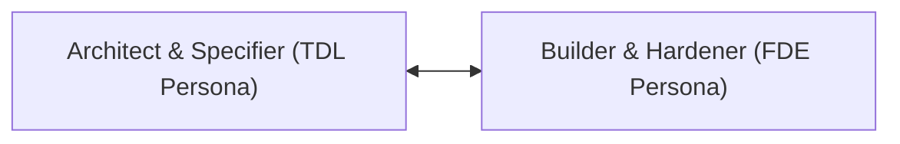

# Technical Deployment Lead (TDL) Field Execution Playbook

Operational execution playbook for Technical Deployment Leads (TDLs) managing 12-week Google Cloud enterprise engagements.

---

## 1. Dynamic Capability Resolution Matrix

```
[Inspect STATE.md] --> [Run verify_phase_gate.py] --> [Resolve Phase Capability Slots] --> [Execute Gate Verification]
```

### Capability Slot Mapping (Tier 1 & Tier 2)

| Phase | Capability Slot | Primary Tool (Tier 1) | Extended Tools (Tier 2) |
|---|---|---|---|
| **Phase 1** | `#CAPABILITY: Skill-Stocktake` | `skill-stocktake` | `using-agent-skills` |
| **Phase 1** | `#CAPABILITY: Codebase-Onboarding` | `codebase-onboarding-and-mapping` | `graphify` (AST Knowledge Graph) |
| **Phase 1** | `#CAPABILITY: Repo-Conventions` | `ecc-repo-conventions` | `git-workflow-and-versioning` |
| **Phase 1** | `#CAPABILITY: Customer-Intake` | `workshop-intake` | `interview-me` |
| **Phase 1** | `#CAPABILITY: Scope-Mapping` | `opportunity-solution-tree` | `user-stories`, `job-stories` |
| **Phase 1** | `#CAPABILITY: PRD-Creation` | `create-prd` | `spec-driven-development` |
| **Phase 1** | `#CAPABILITY: Baseline-Audit` | `synthetic-baseline-protocol` | `ai-value-sizing` |
| **Phase 2** | `#CAPABILITY: GCP-Architecture-Advisor`| `gcp-agent-architecture-advisor` | `grill-with-docs`, `google-agents-cli-scaffold` |
| **Phase 2** | `#CAPABILITY: Executive-Persona-Review`| `gstack` | `strategy-red-team` |
| **Phase 2** | `#CAPABILITY: Tech-Design-Document` | `documentation-and-adrs` | `spec-driven-development` |
| **Phase 2** | `#CAPABILITY: API-Design` | `api-and-interface-design` | `domain-modeling`, `codebase-design` |
| **Phase 2** | `#CAPABILITY: InfoSec-Threat-Modeling`| `threat-model-analyst` | `google-cloud-waf-security`, `agent-governance`, `security-and-hardening` |
| **Phase 3** | `#CAPABILITY: Fleet-Management` | `agentic-engineering` | `caveman` |
| **Phase 3** | `#CAPABILITY: Task-Breakdown` | `planning-and-task-breakdown` | `to-tickets`, `feature-tracking` |
| **Phase 3** | `#CAPABILITY: TDD-Build` | `test-driven-development` | `superpowers`, `implement`, `source-driven-development` |
| **Phase 3** | `#CAPABILITY: Code-Simplification` | `ponytail` | `code-simplification` |
| **Phase 3** | `#CAPABILITY: Intent-Audit` | `intended-vs-implemented` | `sql-queries` (pipeline validation) |
| **Phase 3** | `#CAPABILITY: Code-Review` | `code-review-and-quality` | `pso-code-quality-reviewer` |
| **Phase 4** | `#CAPABILITY: Agent-Evaluation` | `google-agents-cli-eval` | `eval-quality-gate` |
| **Phase 4** | `#CAPABILITY: ROI-Sizing` | `ai-value-sizing` | `cohort-analysis`, `ab-test-analysis` |
| **Phase 4** | `#CAPABILITY: Release-Deployment` | `shipping-and-launch` | `google-agents-cli-deploy`, `google-agents-cli-publish`, `google-agents-cli-observability` |
| **Phase 4** | `#CAPABILITY: Handoff-Artifacts` | `shipping-artifacts` | `release-notes`, `retro` |

---

## 2. Lean 2-Role Squad Matrix & Governance Rules


```mermaid
graph LR
    A["Architect & Specifier (TDL Persona)"] <--> B["Builder & Hardener (FDE Persona)"]
```

### 2-Role Responsibilities:
1. **Architect & Specifier (TDL Persona)**: Owns discovery, PRD creation, GCP 3-tier architecture advisory, InfoSec threat modeling, state tracking (`STATE.md`), and programmatic phase gate enforcement.
2. **Builder & Hardener (FDE Persona)**: Owns task breakdown, TDD red-green-refactor build loops, AST refactoring, intent gap audits, secret scanning, and CI/CD deployment.

### Core Governance Rules:
* **12-Week Capped Window**: Fixed milestone target window.
* **1-in, 1-out Scope Governance**: Mid-flight feature requests swap equivalent RICE-scored items.
* **Synthetic Baseline Protocol**: Execute 50-sample retrospective SME audit in Phase 1 producing `baseline_kpis.json`.
* **Programmatic Gate Enforcement**: Must run `python3 scripts/verify_phase_gate.py --phase N` before advancing state in `STATE.md`.

---

## 3. Production Code Templates & Boilerplate

This skill includes production-ready code templates inside `templates/` for rapid execution during Phase 3 TDD:

| Template Path | Purpose & Features |
|---|---|
| `templates/fastapi_main.py` | Production FastAPI application with lifespan context, health checks (`/healthz`, `/readyz`), CORS middleware, and GCP Secret Manager. |
| `templates/pydantic_v2_schemas.py` | Pydantic v2 `BaseModel` schemas with `ConfigDict(extra="forbid")`, OpenAPI examples, and custom validators. |
| `templates/pytest_fixtures.py` | PyTest fixtures providing `httpx.AsyncClient` ASGI transport, mock secret clients, and environment variable overrides. |

---

## 4. Execution Lifecycle & Programmatic Gate Checks

### Phase 1: Discover & Define (Weeks 0-2 | TDL Persona)
* **Actions**: Run `#CAPABILITY: Skill-Stocktake`, `#CAPABILITY: Codebase-Onboarding` (`codebase-onboarding-and-mapping` ➔ `docs/ONBOARDING.md`), `#CAPABILITY: PRD-Creation` (`PRD.md`), and `#CAPABILITY: Baseline-Audit` (`synthetic-baseline-protocol` ➔ `baseline_kpis.json`).
* **Automated Gate Check**:
  ```bash
  python3 scripts/verify_phase_gate.py --phase 1
  ```
* **Exit Condition**: `verify_phase_gate.py` passes (verifying `docs/ONBOARDING.md`, `PRD.md`, `baseline_kpis.json`, and zero exposed secrets) before updating `STATE.md` to Phase 2.

### Phase 2: Prototype & Validate (Weeks 3-6 | TDL + FDE)
* **Actions**: Run `#CAPABILITY: GCP-Architecture-Advisor` (`gcp-agent-architecture-advisor` -> `docs/ARCHITECTURE_RECOMMENDATION.md`), `#CAPABILITY: Tech-Design-Document` (`docs/TDD.md`), and `#CAPABILITY: InfoSec-Threat-Modeling`.
* **ADK Agent Setup**: Invoke `google-agents-cli-scaffold` and `google-agents-cli-adk-code`.
* **Automated Gate Check**:
  ```bash
  python3 scripts/verify_phase_gate.py --phase 2
  ```
* **Exit Condition**: `verify_phase_gate.py` passes (verifying `docs/ARCHITECTURE_RECOMMENDATION.md` and `docs/TDD.md`) before updating `STATE.md` to Phase 3.

### Phase 3: Production Build (Weeks 6-10 | FDE Persona)
* **Actions**: Configure `#CAPABILITY: Fleet-Management` (`agentic-engineering`), run `#CAPABILITY: Task-Breakdown`, drive `#CAPABILITY: TDD-Build` using templates in `templates/`, and execute `#CAPABILITY: Code-Review`.
* **Regression Loop**: If architectural flaws are discovered, write `ACTION: ROLLBACK_TO_PHASE_2` in `STATE.md`.
* **Automated Gate Check**:
  ```bash
  python3 scripts/verify_phase_gate.py --phase 3
  ```
* **Exit Condition**: `verify_phase_gate.py` passes (verifying 100% pytest pass rate and zero secret exposures) before updating `STATE.md` to Phase 4.

### Phase 4: Harden & Launch (Weeks 11-12 | Full Squad)
* **Actions**: Run `#CAPABILITY: Agent-Evaluation`, deploy via `#CAPABILITY: Release-Deployment`, configure observability, and compile `#CAPABILITY: Handoff-Artifacts`.
* **Automated Gate Check**:
  ```bash
  python3 scripts/verify_phase_gate.py --phase 4
  ```
* **Exit Condition**: `verify_phase_gate.py` passes (verifying `docs/HANDOFF_PACKET.md` and post-eval ROI calculations in `baseline_kpis.json`).
