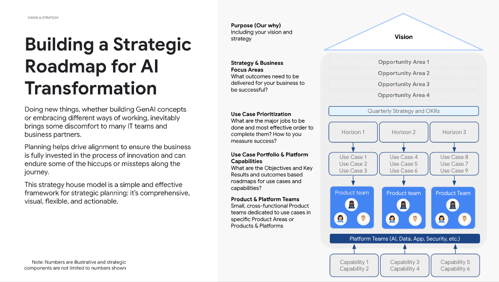
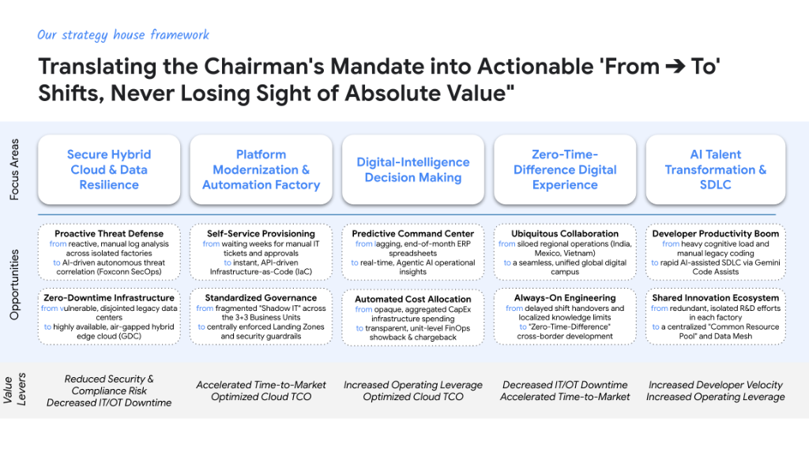
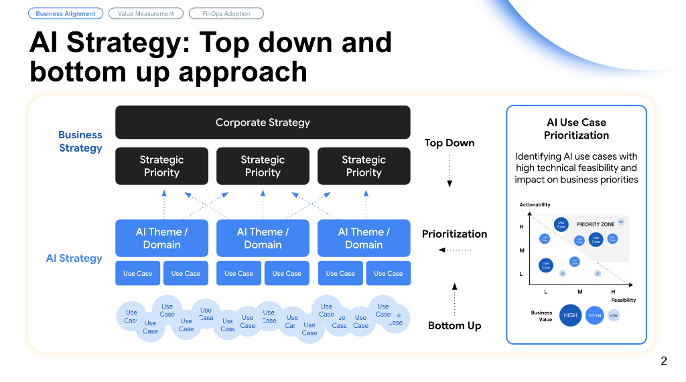

# Strategy House Skill

This skill guides the process of transforming raw financial data (10-Ks, earnings calls, investor presentations) into a structured "Strategy House" and "Opportunity Matrix." It ensures strategic alignment from high-level vision to ground-level execution.

## Mandatory Research Standards
It is CRITICAL that you analyze a minimum of the **last 8 quarters** of financial documents and reports for the target company.
- **Sources:** Latest 10-K and 10-Q filings, transcripts from the last 8 Earnings Calls, recent Analyst Reports, and Investor Presentations.
- **Evidence:** Gather specific baseline metrics, dependencies, and department-level accountability.

## Strategic Framework (5-Section Model)
You MUST follow this specific 5-section framework for your analysis:

1.  **Vision (The Roof):** Synthesize the official Mission, Aspiration, Core Problem, and Future State into a SINGLE, cohesive, inspiring paragraph (2-3 sentences). Do NOT use separate labels.
2.  **Strategy & Business Focus Areas (The Pillars):** Identify 3 to 5 Focus Areas with high-level outcomes and the specific problems being solved.
3.  **Prioritization (The Phases):** Define exactly 3 distinct Phases (e.g., Stabilization, Optimization, Transformation). Identify 3-4 Use Cases per phase with Business Value (ROI) and Tech Feasibility scores.
4.  **Measure Success (OKRs/KPIs):** Define 3-6 Objectives and Key Results. Every phase must have at least one OKR. Map Baseline -> Target metrics.
5.  **Impacted Teams:** Identify at least 3 distinct Business Units or Departments. Format: "Business Unit - Role/Impact". Do NOT name specific individuals.

## Progressive Disclosure
For detailed templates and technical schemas, refer to:
- [Strategy House Template](references/strategy-house-template.md)
- [Technical Strategy Schema](references/strategy-schema.ts)

## Visual Models
See the strategic frameworks here:
- **Strategy House Model:**

- **From-To Shifts:**

- **Top-Down & Bottom-Up Approach:**

